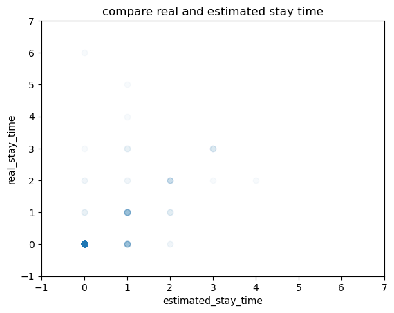

## singular Trajectory Test

Generate 100 trajectories, moving from (1,1) to (10,10) following shortest path, meaning that every move is to the right or the upper.


### Bigram with attention

```
11m 52.3s

0.213349 M parameters
step 0: train loss 4.6590, val loss 4.6072
step 100: train loss 0.7194, val loss 0.7682
step 200: train loss 0.5070, val loss 0.5614
step 300: train loss 0.4060, val loss 0.4769
step 400: train loss 0.3557, val loss 0.3789
step 500: train loss 0.3269, val loss 0.3566
step 600: train loss 0.3201, val loss 0.3409
step 700: train loss 0.3230, val loss 0.3466
step 800: train loss 0.2943, val loss 0.3436
step 900: train loss 0.2992, val loss 0.3370
step 1000: train loss 0.2940, val loss 0.3333
step 1100: train loss 0.2821, val loss 0.3137
step 1200: train loss 0.3050, val loss 0.3546
step 1300: train loss 0.2692, val loss 0.3127
step 1400: train loss 0.2715, val loss 0.3297
step 1500: train loss 0.2817, val loss 0.3053
step 1600: train loss 0.2726, val loss 0.3050
step 1700: train loss 0.2711, val loss 0.3247
step 1800: train loss 0.2671, val loss 0.2979
step 1900: train loss 0.2839, val loss 0.3028
step 2000: train loss 0.2696, val loss 0.3154
step 2100: train loss 0.2706, val loss 0.2959
step 2200: train loss 0.2709, val loss 0.3023
...
step 4700: train loss 0.2532, val loss 0.3234
step 4800: train loss 0.2468, val loss 0.3142
step 4900: train loss 0.2427, val loss 0.3122
step 4999: train loss 0.2472, val loss 0.3154
```


## Cooperative Trajectory Generation

### trajectory simulation

generate 20 car trajectories, each time a car has to wait for stay time, and once moves to the next point, the stay time is updated according to the staying cars

simulation results: 

### model details

input should be [B, T, N], B is batch size, T is temporal length, N is trajectory numbers. For each trajectory, the model predicts a slide: [t:t+T] -> [t+1,t+T+1]

the model first does self-attention on T channel, then does self-attention on N channel.

the input should consider at least N/2 T. Because, if it predicts the whole grid one time by one time, at time [1:N/2], all cars have to wait on (1,2) or (2,1), there is no pattern.

### generation results.

1. if input is only the start point, which means the network only knows that all cars stay at (1,1) at time 1:
   
2. if input is the training data, car positions during the first T time steps (10), which means all cars move 10 time accroding to training route and predict the rest trajectory:
   
3. if input is the resampled data, car positions during the first T time steps (10), which means all cars move 10 time freely and predict the rest trajectory:
   

**Only one car cannot provide the jam situation, so the first one failed. The second one is not a copy of simulation, it is infact generated according to the car movement of first 10 time steps. In the third generation, only one trajectory is wrong, and I repeated for 3 times, each time there is one mistake**

### more training simulation

route:

```
Trajectory 1:Total stay time: 71, Wrong stay time: 10:
Trajectory 2:Total stay time: 71, Wrong stay time: 6:
Trajectory 3:Total stay time: 71, Wrong stay time: 18:
Trajectory 4:Total stay time: 71, Wrong stay time: 4:
Trajectory 5:Total stay time: 71, Wrong stay time: 7:
Trajectory 9:Total stay time: 71, Wrong stay time: 3:
Trajectory 7:Total stay time: 71, Wrong stay time: 3:
Trajectory 8:Total stay time: 71, Wrong stay time: 3:
Trajectory 9:Total stay time: 71, Wrong stay time: 8:
Trajectory 10:Total stay time: 71, Wrong stay time: 12:
```

image:


## Cooperative Trajectory Generation with random OD

### (1, 1) -> (10, 10) (1, 10)->(10, 1)

image:
ç

### add OD explicit, avoid turn back

x: should wait for how many step , y: infact wait for how many step, all cars in one fig

#### without OD:

```
Trajectory 1:Total stay time: 70, Wrong stay time: 1:  (1, 1) (2, 1) (2, 1) (2, 1) (2, 1) (2, 1) (3, 1) (3, 2) (4, 2) (5, 2) (5, 3) (5, 4) (5, 5) (6, 5) (6, 6) (5, 6) (6, 6) (6, 5) (6, 4) (7, 4) (7, 3) (8, 3) (9, 3) (8, 3) (9, 3) (10, 3) (10, 2) (10, 1) (10, 1) (10, 1) (10, 1) (10, 1) (10, 1) (10, 1) (10, 1) (10, 1) (10, 1) (10, 1) (10, 1) (10, 1) (10, 1) (10, 1) (10, 1) (10, 1) (10, 1) (10, 1) (10, 1) (10, 1) (10, 1) (10, 1) (10, 1) (10, 1) (10, 1) (10, 1) (10, 1) (10, 1) (10, 1) (10, 1) (10, 1) (10, 1) (10, 1) (10, 1) (10, 1) (10, 1) (10, 1) (10, 1) (10, 1) (10, 1) (10, 1) (10, 1)
Trajectory 2:Total stay time: 70, Wrong stay time: 4:  (1, 1) (2, 1) (2, 1) (2, 1) (2, 1) (2, 1) (2, 2) (2, 2) (2, 2) (2, 2) (2, 2) (3, 2) (3, 2) (3, 2) (3, 3) (4, 3) (5, 3) (6, 3) (6, 4) (6, 4) (7, 4) (7, 5) (8, 5) (9, 5) (9, 6) (9, 7) (10, 7) (10, 8) (10, 9) (10, 10) (10, 10) (10, 10) (10, 10) (10, 10) (10, 10) (10, 10) (10, 10) (10, 10) (10, 10) (10, 10) (10, 10) (10, 10) (10, 10) (10, 10) (10, 10) (10, 10) (10, 10) (10, 10) (10, 10) (10, 10) (10, 10) (10, 10) (10, 10) (10, 10) (10, 10) (10, 10) (10, 10) (10, 10) (10, 10) (10, 10) (10, 10) (10, 10) (10, 10) (10, 10) (10, 10) (10, 10) (10, 10) (10, 10) (10, 10) (10, 10)
Trajectory 3:Total stay time: 70, Wrong stay time: 7:  (1, 1) (2, 1) (2, 1) (2, 1) (2, 1) (2, 1) (2, 2) (2, 2) (2, 2) (2, 2) (2, 2) (2, 2) (2, 2) (2, 2) (3, 2) (3, 2) (3, 3) (3, 4) (3, 5) (3, 4) (4, 4) (4, 5) (5, 5) (5, 5) (6, 5) (6, 5) (7, 5) (7, 5) (8, 5) (8, 4) (8, 4) (8, 4) (8, 3) (9, 3) (10, 3) (10, 2) (10, 1) (10, 1) (10, 1) (10, 1) (10, 1) (10, 1) (10, 1) (10, 1) (10, 1) (10, 1) (10, 1) (10, 1) (10, 1) (10, 1) (10, 1) (10, 1) (10, 1) (10, 1) (10, 1) (10, 1) (10, 1) (10, 1) (10, 1) (10, 1) (10, 1) (10, 1) (10, 1) (10, 1) (10, 1) (10, 1) (10, 1) (10, 1) (10, 1) (10, 1)
Trajectory 4:Total stay time: 70, Wrong stay time: 7:  (1, 1) (1, 2) (1, 2) (1, 2) (1, 2) (1, 2) (1, 3) (1, 3) (1, 3) (1, 4) (2, 4) (2, 4) (3, 4) (3, 4) (3, 5) (3, 5) (3, 6) (3, 7) (3, 7) (3, 6) (3, 6) (4, 6) (5, 6) (5, 6) (5, 6) (5, 6) (5, 5) (6, 5) (6, 5) (7, 5) (7, 5) (8, 5) (9, 5) (9, 4) (9, 3) (9, 2) (10, 2) (10, 1) (10, 1) (10, 1) (10, 1) (10, 1) (10, 1) (10, 1) (10, 1) (10, 1) (10, 1) (10, 1) (10, 1) (10, 1) (10, 1) (10, 1) (10, 1) (10, 1) (10, 1) (10, 1) (10, 1) (10, 1) (10, 1) (10, 1) (10, 1) (10, 1) (10, 1) (10, 1) (10, 1) (10, 1) (10, 1) (10, 1) (10, 1) (10, 1)
Trajectory 5:Total stay time: 70, Wrong stay time: 2:  (1, 1) (2, 1) (2, 1) (2, 1) (2, 1) (2, 1) (2, 2) (2, 2) (2, 2) (2, 2) (3, 2) (3, 2) (4, 2) (4, 2) (5, 2) (5, 2) (6, 2) (7, 2) (8, 2) (8, 1) (9, 1) (10, 1) (10, 1) (10, 1) (10, 1) (10, 1) (10, 1) (10, 1) (10, 1) (10, 1) (10, 1) (10, 1) (10, 1) (10, 1) (10, 1) (10, 1) (10, 1) (10, 1) (10, 1) (10, 1) (10, 1) (10, 1) (10, 1) (10, 1) (10, 1) (10, 1) (10, 1) (10, 1) (10, 1) (10, 1) (10, 1) (10, 1) (10, 1) (10, 1) (10, 1) (10, 1) (10, 1) (10, 1) (10, 1) (10, 1) (10, 1) (10, 1) (10, 1) (10, 1) (10, 1) (10, 1) (10, 1) (10, 1) (10, 1) (10, 1)
Trajectory 6:Total stay time: 70, Wrong stay time: 7:  (1, 1) (1, 2) (1, 2) (1, 2) (1, 2) (1, 2) (1, 3) (1, 3) (1, 3) (1, 4) (2, 4) (2, 4) (2, 5) (2, 6) (2, 7) (3, 7) (4, 7) (4, 7) (5, 7) (5, 7) (5, 6) (5, 6) (5, 5) (5, 5) (6, 5) (6, 5) (6, 6) (6, 7) (6, 8) (6, 9) (7, 9) (7, 10) (8, 10) (9, 10) (10, 10) (10, 10) (10, 10) (10, 10) (10, 10) (10, 10) (10, 10) (10, 10) (10, 10) (10, 10) (10, 10) (10, 10) (10, 10) (10, 10) (10, 10) (10, 10) (10, 10) (10, 10) (10, 10) (10, 10) (10, 10) (10, 10) (10, 10) (10, 10) (10, 10) (10, 10) (10, 10) (10, 10) (10, 10) (10, 10) (10, 10) (10, 10) (10, 10) (10, 10) (10, 10) (10, 10)
Trajectory 7:Total stay time: 70, Wrong stay time: 4:  (1, 1) (1, 2) (1, 2) (1, 2) (1, 2) (1, 2) (2, 2) (2, 2) (2, 2) (2, 2) (3, 2) (3, 2) (4, 2) (4, 2) (5, 2) (5, 3) (6, 3) (6, 3) (6, 2) (7, 2) (8, 2) (9, 2) (10, 2) (10, 3) (10, 2) (10, 1) (10, 1) (10, 1) (10, 1) (10, 1) (10, 1) (10, 1) (10, 1) (10, 1) (10, 1) (10, 1) (10, 1) (10, 1) (10, 1) (10, 1) (10, 1) (10, 1) (10, 1) (10, 1) (10, 1) (10, 1) (10, 1) (10, 1) (10, 1) (10, 1) (10, 1) (10, 1) (10, 1) (10, 1) (10, 1) (10, 1) (10, 1) (10, 1) (10, 1) (10, 1) (10, 1) (10, 1) (10, 1) (10, 1) (10, 1) (10, 1) (10, 1) (10, 1) (10, 1) (10, 1)
Trajectory 8:Total stay time: 70, Wrong stay time: 2:  (1, 1) (1, 2) (1, 2) (1, 2) (1, 2) (1, 2) (2, 2) (2, 2) (2, 2) (2, 2) (3, 2) (3, 2) (3, 2) (3, 2) (3, 3) (3, 3) (3, 3) (4, 3) (4, 4) (5, 4) (6, 4) (7, 4) (7, 5) (8, 5) (9, 5) (9, 4) (10, 4) (10, 3) (10, 2) (10, 1) (10, 1) (10, 1) (10, 1) (10, 1) (10, 1) (10, 1) (10, 1) (10, 1) (10, 1) (10, 1) (10, 1) (10, 1) (10, 1) (10, 1) (10, 1) (10, 1) (10, 1) (10, 1) (10, 1) (10, 1) (10, 1) (10, 1) (10, 1) (10, 1) (10, 1) (10, 1) (10, 1) (10, 1) (10, 1) (10, 1) (10, 1) (10, 1) (10, 1) (10, 1) (10, 1) (10, 1) (10, 1) (10, 1) (10, 1) (10, 1)
Trajectory 9:Total stay time: 70, Wrong stay time: 4:  (1, 1) (1, 2) (1, 2) (1, 2) (1, 2) (1, 2) (1, 3) (1, 3) (1, 3) (1, 4) (2, 4) (2, 4) (3, 4) (3, 4) (3, 5) (3, 5) (3, 6) (4, 6) (5, 6) (6, 6) (7, 6) (7, 7) (8, 7) (9, 7) (9, 7) (9, 6) (9, 7) (9, 7) (9, 8) (9, 9) (10, 9) (10, 9) (10, 10) (10, 10) (10, 10) (10, 10) (10, 10) (10, 10) (10, 10) (10, 10) (10, 10) (10, 10) (10, 10) (10, 10) (10, 10) (10, 10) (10, 10) (10, 10) (10, 10) (10, 10) (10, 10) (10, 10) (10, 10) (10, 10) (10, 10) (10, 10) (10, 10) (10, 10) (10, 10) (10, 10) (10, 10) (10, 10) (10, 10) (10, 10) (10, 10) (10, 10) (10, 10) (10, 10) (10, 10) (10, 10)
Trajectory 10:Total stay time: 70, Wrong stay time: 2:  (1, 1) (2, 1) (2, 1) (2, 1) (2, 1) (2, 1) (2, 2) (2, 2) (2, 2) (2, 2) (2, 2) (2, 2) (2, 2) (2, 3) (3, 3) (3, 3) (3, 3) (3, 3) (3, 2) (4, 2) (4, 1) (5, 1) (6, 1) (7, 1) (8, 1) (9, 1) (10, 1) (10, 1) (10, 1) (10, 1) (10, 1) (10, 1) (10, 1) (10, 1) (10, 1) (10, 1) (10, 1) (10, 1) (10, 1) (10, 1) (10, 1) (10, 1) (10, 1) (10, 1) (10, 1) (10, 1) (10, 1) (10, 1) (10, 1) (10, 1) (10, 1) (10, 1) (10, 1) (10, 1) (10, 1) (10, 1) (10, 1) (10, 1) (10, 1) (10, 1) (10, 1) (10, 1) (10, 1) (10, 1) (10, 1) (10, 1) (10, 1) (10, 1) (10, 1) (10, 1)
Trajectory 11:Total stay time: 70, Wrong stay time: 1:  (1, 10) (2, 10) (2, 10) (2, 10) (2, 10) (2, 10) (2, 10) (2, 10) (3, 10) (3, 10) (3, 10) (4, 10) (5, 10) (6, 10) (6, 9) (6, 10) (6, 9) (7, 9) (7, 10) (8, 10) (9, 10) (10, 10) (10, 10) (10, 10) (10, 10) (10, 10) (10, 10) (10, 10) (10, 10) (10, 10) (10, 10) (10, 10) (10, 10) (10, 10) (10, 10) (10, 10) (10, 10) (10, 10) (10, 10) (10, 10) (10, 10) (10, 10) (10, 10) (10, 10) (10, 10) (10, 10) (10, 10) (10, 10) (10, 10) (10, 10) (10, 10) (10, 10) (10, 10) (10, 10) (10, 10) (10, 10) (10, 10) (10, 10) (10, 10) (10, 10) (10, 10) (10, 10) (10, 10) (10, 10) (10, 10) (10, 10) (10, 10) (10, 10) (10, 10) (10, 10)
Trajectory 12:Total stay time: 70, Wrong stay time: 6:  (1, 10) (1, 9) (1, 9) (1, 9) (1, 8) (1, 8) (1, 8) (1, 7) (2, 7) (2, 6) (2, 5) (3, 5) (4, 5) (4, 4) (5, 4) (5, 5) (6, 5) (7, 5) (7, 5) (7, 5) (7, 5) (7, 6) (7, 7) (7, 7) (7, 7) (7, 8) (7, 9) (8, 9) (9, 9) (10, 9) (10, 9) (10, 10) (10, 10) (10, 10) (10, 10) (10, 10) (10, 10) (10, 10) (10, 10) (10, 10) (10, 10) (10, 10) (10, 10) (10, 10) (10, 10) (10, 10) (10, 10) (10, 10) (10, 10) (10, 10) (10, 10) (10, 10) (10, 10) (10, 10) (10, 10) (10, 10) (10, 10) (10, 10) (10, 10) (10, 10) (10, 10) (10, 10) (10, 10) (10, 10) (10, 10) (10, 10) (10, 10) (10, 10) (10, 10) (10, 10)
Trajectory 13:Total stay time: 70, Wrong stay time: 5:  (1, 10) (1, 9) (1, 9) (1, 9) (1, 8) (1, 8) (1, 8) (2, 8) (2, 8) (3, 8) (4, 8) (4, 8) (5, 8) (5, 7) (5, 6) (6, 6) (6, 5) (7, 5) (7, 5) (8, 5) (8, 5) (9, 5) (9, 4) (9, 3) (10, 3) (10, 2) (10, 1) (10, 1) (10, 1) (10, 1) (10, 1) (10, 1) (10, 1) (10, 1) (10, 1) (10, 1) (10, 1) (10, 1) (10, 1) (10, 1) (10, 1) (10, 1) (10, 1) (10, 1) (10, 1) (10, 1) (10, 1) (10, 1) (10, 1) (10, 1) (10, 1) (10, 1) (10, 1) (10, 1) (10, 1) (10, 1) (10, 1) (10, 1) (10, 1) (10, 1) (10, 1) (10, 1) (10, 1) (10, 1) (10, 1) (10, 1) (10, 1) (10, 1) (10, 1) (10, 1)
Trajectory 14:Total stay time: 70, Wrong stay time: 7:  (1, 10) (2, 10) (2, 10) (2, 10) (2, 10) (2, 10) (2, 10) (2, 10) (3, 10) (3, 10) (3, 10) (3, 9) (3, 8) (3, 8) (3, 8) (3, 8) (3, 8) (4, 8) (4, 8) (4, 7) (4, 7) (4, 7) (4, 6) (4, 6) (5, 6) (5, 6) (6, 6) (6, 6) (7, 6) (7, 5) (7, 5) (7, 4) (7, 3) (8, 3) (9, 3) (10, 3) (10, 2) (10, 2) (10, 1) (10, 1) (10, 1) (10, 1) (10, 1) (10, 1) (10, 1) (10, 1) (10, 1) (10, 1) (10, 1) (10, 1) (10, 1) (10, 1) (10, 1) (10, 1) (10, 1) (10, 1) (10, 1) (10, 1) (10, 1) (10, 1) (10, 1) (10, 1) (10, 1) (10, 1) (10, 1) (10, 1) (10, 1) (10, 1) (10, 1) (10, 1)
Trajectory 15:Total stay time: 70, Wrong stay time: 7:  (1, 10) (2, 10) (2, 10) (2, 10) (2, 10) (2, 10) (2, 10) (2, 10) (2, 9) (2, 9) (2, 9) (2, 9) (3, 9) (3, 8) (3, 8) (4, 8) (4, 7) (4, 7) (5, 7) (5, 6) (5, 6) (5, 6) (5, 6) (5, 6) (6, 6) (7, 6) (7, 5) (7, 5) (8, 5) (8, 5) (8, 4) (8, 4) (9, 4) (10, 4) (10, 5) (10, 6) (10, 7) (10, 8) (10, 9) (10, 10) (10, 10) (10, 10) (10, 10) (10, 10) (10, 10) (10, 10) (10, 10) (10, 10) (10, 10) (10, 10) (10, 10) (10, 10) (10, 10) (10, 10) (10, 10) (10, 10) (10, 10) (10, 10) (10, 10) (10, 10) (10, 10) (10, 10) (10, 10) (10, 10) (10, 10) (10, 10) (10, 10) (10, 10) (10, 10) (10, 10)
Trajectory 16:Total stay time: 70, Wrong stay time: 5:  (1, 10) (2, 10) (2, 10) (2, 10) (2, 10) (2, 10) (2, 10) (2, 10) (2, 9) (2, 9) (2, 9) (2, 9) (2, 8) (2, 8) (2, 7) (2, 7) (2, 7) (3, 7) (3, 7) (4, 7) (4, 7) (5, 7) (6, 7) (7, 7) (7, 7) (8, 7) (9, 7) (9, 8) (9, 9) (10, 9) (10, 9) (10, 10) (10, 10) (10, 10) (10, 10) (10, 10) (10, 10) (10, 10) (10, 10) (10, 10) (10, 10) (10, 10) (10, 10) (10, 10) (10, 10) (10, 10) (10, 10) (10, 10) (10, 10) (10, 10) (10, 10) (10, 10) (10, 10) (10, 10) (10, 10) (10, 10) (10, 10) (10, 10) (10, 10) (10, 10) (10, 10) (10, 10) (10, 10) (10, 10) (10, 10) (10, 10) (10, 10) (10, 10) (10, 10) (10, 10)
Trajectory 17:Total stay time: 70, Wrong stay time: 6:  (1, 10) (2, 10) (2, 10) (2, 10) (2, 10) (2, 10) (2, 10) (2, 10) (3, 10) (3, 10) (3, 10) (3, 9) (3, 8) (3, 8) (3, 8) (3, 8) (3, 7) (4, 7) (5, 7) (5, 7) (5, 6) (5, 6) (5, 6) (3, 5) (4, 5) (5, 5) (6, 5) (6, 4) (7, 4) (8, 4) (8, 3) (9, 3) (10, 7) (10, 8) (10, 9) (10, 10) (10, 10) (10, 10) (10, 10) (10, 10) (10, 10) (10, 10) (10, 10) (10, 10) (10, 10) (10, 10) (10, 10) (10, 10) (10, 10) (10, 10) (10, 10) (10, 10) (10, 10) (10, 10) (10, 10) (10, 10) (10, 10) (10, 10) (10, 10) (10, 10) (10, 10) (10, 10) (10, 10) (10, 10) (10, 10) (10, 10) (10, 10) (10, 10) (10, 10) (10, 10)
Trajectory 18:Total stay time: 70, Wrong stay time: 3:  (1, 10) (1, 9) (1, 9) (1, 9) (1, 8) (1, 8) (1, 8) (2, 8) (2, 8) (3, 8) (4, 8) (4, 8) (5, 8) (6, 8) (6, 7) (6, 6) (7, 6) (8, 6) (9, 6) (9, 5) (9, 4) (10, 4) (10, 3) (10, 2) (10, 1) (10, 1) (10, 1) (10, 1) (10, 1) (10, 1) (10, 1) (10, 1) (10, 1) (10, 1) (10, 1) (10, 1) (10, 1) (10, 1) (10, 1) (10, 1) (10, 1) (10, 1) (10, 1) (10, 1) (10, 1) (10, 1) (10, 1) (10, 1) (10, 1) (10, 1) (10, 1) (10, 1) (10, 1) (10, 1) (10, 1) (10, 1) (10, 1) (10, 1) (10, 1) (10, 1) (10, 1) (10, 1) (10, 1) (10, 1) (10, 1) (10, 1) (10, 1) (10, 1) (10, 1) (10, 1)
Trajectory 19:Total stay time: 70, Wrong stay time: 1:  (1, 10) (2, 10) (2, 10) (2, 10) (2, 10) (2, 10) (2, 10) (2, 10) (3, 10) (3, 10) (4, 10) (5, 10) (6, 10) (6, 9) (7, 9) (7, 10) (8, 10) (8, 9) (8, 10) (9, 10) (3, 9) (3, 10) (4, 10) (5, 10) (6, 10) (7, 10) (8, 10) (9, 10) (10, 10) (10, 10) (10, 10) (10, 10) (10, 10) (10, 10) (10, 10) (10, 10) (10, 10) (10, 10) (10, 10) (10, 10) (10, 10) (10, 10) (10, 10) (10, 10) (10, 10) (10, 10) (10, 10) (10, 10) (10, 10) (10, 10) (10, 10) (10, 10) (10, 10) (10, 10) (10, 10) (10, 10) (10, 10) (10, 10) (10, 10) (10, 10) (10, 10) (10, 10) (10, 10) (10, 10) (10, 10) (10, 10) (10, 10) (10, 10) (10, 10) (10, 10)
Trajectory 20:Total stay time: 70, Wrong stay time: 6:  (1, 10) (2, 10) (2, 10) (2, 10) (2, 10) (2, 10) (2, 10) (2, 10) (2, 9) (2, 9) (2, 9) (2, 8) (3, 8) (3, 8) (3, 8) (3, 8) (3, 8) (4, 8) (5, 8) (5, 7) (5, 7) (5, 6) (5, 5) (5, 5) (5, 4) (6, 4) (7, 4) (8, 4) (9, 4) (10, 4) (10, 3) (10, 2) (10, 1) (10, 1) (10, 1) (10, 1) (10, 1) (10, 1) (10, 1) (10, 1) (10, 1) (10, 1) (10, 1) (10, 1) (10, 1) (10, 1) (10, 1) (10, 1) (10, 1) (10, 1) (10, 1) (10, 1) (10, 1) (10, 1) (10, 1) (10, 1) (10, 1) (10, 1) (10, 1) (10, 1) (10, 1) (10, 1) (10, 1) (10, 1) (10, 1) (10, 1) (10, 1) (10, 1) (10, 1) (10, 1)
```

 

#### without OD1:

#OD : (B,2,N)
OD_emb = self.token_embedding_table(OD) # (B,2,N,C)
x = tok_emb + pos_emb# (B,T,N,C)
x = torch.concatenate([OD_emb[:,[0],:,:], x, OD_emb[:,[1],:,:]], dim=1) # (B,T+2,N,C)

```
Trajectory 1:Total stay time: 70, Wrong stay time: 2:  (1, 1) (1, 2) (1, 2) (1, 2) (1, 2) (2, 2) (2, 2) (2, 2) (2, 2) (3, 2) (3, 3) (4, 3) (5, 3) (5, 4) (5, 5) (6, 5) (4, 6) (4, 6) (4, 7) (5, 7) (6, 7) (6, 8) (6, 8) (6, 9) (7, 9) (8, 9) (8, 10) (9, 10) (10, 10) (10, 10) (10, 10) (10, 10) (10, 10) (10, 10) (10, 10) (10, 10) (10, 10) (10, 10) (10, 10) (10, 10) (10, 10) (10, 10) (10, 10) (10, 10) (10, 10) (10, 10) (10, 10) (10, 10) (10, 10) (10, 10) (10, 10) (10, 10) (10, 10) (10, 10) (10, 10) (10, 10) (10, 10) (10, 10) (10, 10) (10, 10) (10, 10) (10, 10) (10, 10) (10, 10) (10, 10) (10, 10) (10, 10) (10, 10) (10, 10) (10, 10)
Trajectory 2:Total stay time: 70, Wrong stay time: 2:  (1, 1) (2, 1) (2, 1) (2, 1) (2, 1) (2, 1) (2, 1) (3, 1) (3, 1) (3, 1) (4, 1) (5, 1) (5, 2) (5, 3) (6, 3) (7, 3) (8, 3) (8, 4) (8, 5) (9, 5) (10, 5) (10, 6) (10, 7) (10, 8) (10, 9) (10, 10) (10, 10) (10, 10) (10, 10) (10, 10) (10, 10) (10, 10) (10, 10) (10, 10) (10, 10) (10, 10) (10, 10) (10, 10) (10, 10) (10, 10) (10, 10) (10, 10) (10, 10) (10, 10) (10, 10) (10, 10) (10, 10) (10, 10) (10, 10) (10, 10) (10, 10) (10, 10) (10, 10) (10, 10) (10, 10) (10, 10) (10, 10) (10, 10) (10, 10) (10, 10) (10, 10) (10, 10) (10, 10) (10, 10) (10, 10) (10, 10) (10, 10) (10, 10) (10, 10) (10, 10)
Trajectory 3:Total stay time: 70, Wrong stay time: 6:  (1, 1) (1, 2) (1, 2) (1, 2) (1, 2) (2, 2) (2, 2) (2, 2) (2, 2) (3, 2) (3, 2) (3, 2) (3, 3) (3, 3) (4, 3) (5, 3) (5, 4) (6, 3) (6, 3) (6, 4) (7, 4) (7, 5) (8, 5) (9, 5) (10, 5) (10, 6) (10, 6) (10, 7) (10, 7) (10, 8) (10, 8) (10, 9) (10, 9) (10, 10) (10, 10) (10, 10) (10, 10) (10, 10) (10, 10) (10, 10) (10, 10) (10, 10) (10, 10) (10, 10) (10, 10) (10, 10) (10, 10) (10, 10) (10, 10) (10, 10) (10, 10) (10, 10) (10, 10) (10, 10) (10, 10) (10, 10) (10, 10) (10, 10) (10, 10) (10, 10) (10, 10) (10, 10) (10, 10) (10, 10) (10, 10) (10, 10) (10, 10) (10, 10) (10, 10) (10, 10)
Trajectory 4:Total stay time: 70, Wrong stay time: 1:  (1, 1) (2, 1) (2, 1) (2, 1) (2, 1) (2, 1) (2, 1) (3, 1) (3, 1) (3, 1) (4, 1) (5, 1) (5, 1) (5, 2) (8, 6) (9, 6) (9, 7) (10, 7) (10, 8) (10, 9) (10, 10) (10, 10) (10, 10) (10, 10) (10, 10) (10, 10) (10, 10) (10, 10) (10, 10) (10, 10) (10, 10) (10, 10) (10, 10) (10, 10) (10, 10) (10, 10) (10, 10) (10, 10) (10, 10) (10, 10) (10, 10) (10, 10) (10, 10) (10, 10) (10, 10) (10, 10) (10, 10) (10, 10) (10, 10) (10, 10) (10, 10) (10, 10) (10, 10) (10, 10) (10, 10) (10, 10) (10, 10) (10, 10) (10, 10) (10, 10) (10, 10) (10, 10) (10, 10) (10, 10) (10, 10) (10, 10) (10, 10) (10, 10) (10, 10) (10, 10)
Trajectory 5:Total stay time: 70, Wrong stay time: 7:  (1, 1) (1, 2) (1, 2) (1, 2) (1, 2) (2, 2) (2, 2) (2, 2) (2, 2) (2, 3) (2, 3) (3, 3) (3, 4) (4, 4) (5, 4) (5, 4) (6, 4) (6, 4) (6, 5) (6, 5) (6, 4) (6, 4) (6, 5) (6, 5) (6, 5) (6, 5) (7, 5) (7, 5) (7, 5) (8, 5) (9, 5) (10, 5) (10, 6) (10, 7) (10, 8) (10, 9) (10, 10) (10, 10) (10, 10) (10, 10) (10, 10) (10, 10) (10, 10) (10, 10) (10, 10) (10, 10) (10, 10) (10, 10) (10, 10) (10, 10) (10, 10) (10, 10) (10, 10) (10, 10) (10, 10) (10, 10) (10, 10) (10, 10) (10, 10) (10, 10) (10, 10) (10, 10) (10, 10) (10, 10) (10, 10) (10, 10) (10, 10) (10, 10) (10, 10) (10, 10)
Trajectory 6:Total stay time: 70, Wrong stay time: 5:  (1, 1) (2, 1) (2, 1) (2, 1) (2, 1) (2, 1) (2, 1) (3, 1) (3, 1) (3, 1) (3, 2) (3, 2) (3, 3) (3, 4) (4, 4) (4, 5) (4, 4) (5, 4) (5, 4) (5, 5) (6, 5) (7, 5) (8, 5) (8, 6) (9, 6) (10, 6) (10, 6) (10, 7) (10, 7) (10, 8) (10, 8) (10, 9) (10, 9) (10, 10) (10, 10) (10, 10) (10, 10) (10, 10) (10, 10) (10, 10) (10, 10) (10, 10) (10, 10) (10, 10) (10, 10) (10, 10) (10, 10) (10, 10) (10, 10) (10, 10) (10, 10) (10, 10) (10, 10) (10, 10) (10, 10) (10, 10) (10, 10) (10, 10) (10, 10) (10, 10) (10, 10) (10, 10) (10, 10) (10, 10) (10, 10) (10, 10) (10, 10) (10, 10) (10, 10) (10, 10)
Trajectory 7:Total stay time: 70, Wrong stay time: 7:  (1, 1) (2, 1) (2, 1) (2, 1) (2, 1) (2, 1) (2, 1) (2, 2) (2, 2) (2, 2) (2, 2) (2, 2) (3, 2) (4, 2) (4, 2) (4, 2) (4, 2) (5, 2) (6, 2) (6, 3) (6, 4) (6, 4) (6, 5) (6, 6) (6, 5) (6, 6) (6, 6) (7, 6) (7, 6) (8, 6) (8, 6) (8, 7) (9, 7) (9, 8) (9, 9) (9, 10) (10, 10) (10, 10) (10, 10) (10, 10) (10, 10) (10, 10) (10, 10) (10, 10) (10, 10) (10, 10) (10, 10) (10, 10) (10, 10) (10, 10) (10, 10) (10, 10) (10, 10) (10, 10) (10, 10) (10, 10) (10, 10) (10, 10) (10, 10) (10, 10) (10, 10) (10, 10) (10, 10) (10, 10) (10, 10) (10, 10) (10, 10) (10, 10) (10, 10) (10, 10)
Trajectory 8:Total stay time: 70, Wrong stay time: 3:  (1, 1) (2, 1) (2, 1) (2, 1) (2, 1) (2, 1) (2, 1) (2, 2) (2, 2) (2, 2) (2, 2) (2, 2) (2, 2) (2, 3) (2, 3) (3, 3) (3, 3) (4, 3) (4, 4) (4, 5) (5, 5) (5, 6) (5, 7) (5, 8) (6, 8) (6, 9) (6, 10) (7, 10) (8, 10) (9, 10) (10, 10) (10, 10) (10, 10) (10, 10) (10, 10) (10, 10) (10, 10) (10, 10) (10, 10) (10, 10) (10, 10) (10, 10) (10, 10) (10, 10) (10, 10) (10, 10) (10, 10) (10, 10) (10, 10) (10, 10) (10, 10) (10, 10) (10, 10) (10, 10) (10, 10) (10, 10) (10, 10) (10, 10) (10, 10) (10, 10) (10, 10) (10, 10) (10, 10) (10, 10) (10, 10) (10, 10) (10, 10) (10, 10) (10, 10) (10, 10)
Trajectory 9:Total stay time: 70, Wrong stay time: 6:  (1, 1) (2, 1) (2, 1) (2, 1) (2, 1) (2, 1) (2, 1) (2, 2) (2, 2) (2, 2) (2, 2) (2, 2) (2, 2) (3, 2) (4, 2) (4, 2) (4, 2) (5, 2) (5, 1) (5, 2) (5, 1) (6, 1) (7, 1) (7, 1) (7, 1) (8, 1) (9, 1) (9, 1) (10, 1) (10, 1) (10, 1) (10, 1) (10, 1) (10, 1) (10, 1) (10, 1) (10, 1) (10, 1) (10, 1) (10, 1) (10, 1) (10, 1) (10, 1) (10, 1) (10, 1) (10, 1) (10, 1) (10, 1) (10, 1) (10, 1) (10, 1) (10, 1) (10, 1) (10, 1) (10, 1) (10, 1) (10, 1) (10, 1) (10, 1) (10, 1) (10, 1) (10, 1) (10, 1) (10, 1) (10, 1) (10, 1) (10, 1) (10, 1) (10, 1) (10, 1)
Trajectory 10:Total stay time: 70, Wrong stay time: 3:  (1, 1) (1, 2) (1, 2) (1, 2) (1, 2) (2, 2) (2, 2) (2, 2) (2, 2) (3, 2) (3, 2) (3, 2) (4, 2) (4, 2) (4, 3) (5, 3) (5, 4) (5, 4) (6, 4) (7, 4) (7, 5) (8, 5) (8, 6) (9, 6) (9, 7) (9, 8) (9, 9) (9, 10) (10, 10) (10, 10) (10, 10) (10, 10) (10, 10) (10, 10) (10, 10) (10, 10) (10, 10) (10, 10) (10, 10) (10, 10) (10, 10) (10, 10) (10, 10) (10, 10) (10, 10) (10, 10) (10, 10) (10, 10) (10, 10) (10, 10) (10, 10) (10, 10) (10, 10) (10, 10) (10, 10) (10, 10) (10, 10) (10, 10) (10, 10) (10, 10) (10, 10) (10, 10) (10, 10) (10, 10) (10, 10) (10, 10) (10, 10) (10, 10) (10, 10) (10, 10)
Trajectory 11:Total stay time: 70, Wrong stay time: 8:  (1, 10) (2, 10) (2, 10) (2, 10) (2, 10) (2, 10) (2, 9) (2, 9) (2, 9) (2, 9) (2, 9) (3, 9) (3, 9) (3, 8) (3, 8) (3, 8) (3, 8) (3, 8) (3, 8) (4, 8) (4, 7) (4, 7) (4, 6) (5, 6) (5, 5) (5, 5) (5, 4) (5, 4) (6, 4) (6, 3) (6, 2) (6, 1) (7, 1) (8, 1) (9, 1) (10, 1) (10, 1) (10, 1) (10, 1) (10, 1) (10, 1) (10, 1) (10, 1) (10, 1) (10, 1) (10, 1) (10, 1) (10, 1) (10, 1) (10, 1) (10, 1) (10, 1) (10, 1) (10, 1) (10, 1) (10, 1) (10, 1) (10, 1) (10, 1) (10, 1) (10, 1) (10, 1) (10, 1) (10, 1) (10, 1) (10, 1) (10, 1) (10, 1) (10, 1) (10, 1)
Trajectory 12:Total stay time: 70, Wrong stay time: 3:  (1, 10) (1, 9) (1, 9) (1, 9) (1, 9) (1, 9) (1, 8) (1, 7) (1, 6) (2, 6) (2, 5) (3, 5) (4, 5) (4, 4) (5, 4) (5, 5) (6, 5) (7, 5) (7, 4) (9, 4) (9, 4) (9, 3) (9, 2) (9, 1) (10, 1) (10, 1) (10, 1) (10, 1) (10, 1) (10, 1) (10, 1) (10, 1) (10, 1) (10, 1) (10, 1) (10, 1) (10, 1) (10, 1) (10, 1) (10, 1) (10, 1) (10, 1) (10, 1) (10, 1) (10, 1) (10, 1) (10, 1) (10, 1) (10, 1) (10, 1) (10, 1) (10, 1) (10, 1) (10, 1) (10, 1) (10, 1) (10, 1) (10, 1) (10, 1) (10, 1) (10, 1) (10, 1) (10, 1) (10, 1) (10, 1) (10, 1) (10, 1) (10, 1) (10, 1) (10, 1)
Trajectory 13:Total stay time: 70, Wrong stay time: 6:  (1, 10) (2, 10) (2, 10) (2, 10) (2, 10) (2, 10) (2, 9) (2, 9) (2, 9) (2, 9) (2, 9) (3, 9) (3, 9) (3, 9) (3, 8) (3, 8) (3, 7) (3, 7) (3, 6) (3, 5) (3, 4) (3, 3) (3, 2) (3, 1) (4, 1) (5, 1) (6, 1) (7, 1) (7, 1) (8, 1) (9, 1) (10, 1) (10, 1) (10, 1) (10, 1) (10, 1) (10, 1) (10, 1) (10, 1) (10, 1) (10, 1) (10, 1) (10, 1) (10, 1) (10, 1) (10, 1) (10, 1) (10, 1) (10, 1) (10, 1) (10, 1) (10, 1) (10, 1) (10, 1) (10, 1) (10, 1) (10, 1) (10, 1) (10, 1) (10, 1) (10, 1) (10, 1) (10, 1) (10, 1) (10, 1) (10, 1) (10, 1) (10, 1) (10, 1) (10, 1)
Trajectory 14:Total stay time: 70, Wrong stay time: 5:  (1, 10) (2, 10) (2, 10) (2, 10) (2, 10) (2, 10) (3, 10) (3, 10) (4, 10) (4, 10) (4, 9) (4, 9) (4, 8) (4, 7) (4, 6) (4, 5) (4, 5) (5, 5) (6, 5) (6, 5) (6, 4) (6, 4) (6, 5) (6, 5) (6, 5) (6, 6) (6, 6) (7, 6) (7, 6) (8, 6) (8, 6) (9, 6) (10, 5) (10, 4) (10, 3) (10, 2) (10, 1) (10, 1) (10, 1) (10, 1) (10, 1) (10, 1) (10, 1) (10, 1) (10, 1) (10, 1) (10, 1) (10, 1) (10, 1) (10, 1) (10, 1) (10, 1) (10, 1) (10, 1) (10, 1) (10, 1) (10, 1) (10, 1) (10, 1) (10, 1) (10, 1) (10, 1) (10, 1) (10, 1) (10, 1) (10, 1) (10, 1) (10, 1) (10, 1) (10, 1)
Trajectory 15:Total stay time: 70, Wrong stay time: 6:  (1, 10) (1, 9) (1, 9) (1, 9) (1, 9) (1, 9) (2, 9) (2, 9) (2, 9) (2, 9) (2, 9) (2, 8) (2, 8) (2, 7) (2, 7) (3, 7) (3, 7) (3, 7) (3, 6) (3, 6) (3, 5) (4, 5) (4, 5) (4, 5) (4, 4) (4, 4) (4, 3) (4, 2) (5, 2) (6, 2) (6, 1) (7, 1) (8, 1) (9, 1) (10, 1) (10, 1) (10, 1) (10, 1) (10, 1) (10, 1) (10, 1) (10, 1) (10, 1) (10, 1) (10, 1) (10, 1) (10, 1) (10, 1) (10, 1) (10, 1) (10, 1) (10, 1) (10, 1) (10, 1) (10, 1) (10, 1) (10, 1) (10, 1) (10, 1) (10, 1) (10, 1) (10, 1) (10, 1) (10, 1) (10, 1) (10, 1) (10, 1) (10, 1) (10, 1) (10, 1)
Trajectory 16:Total stay time: 70, Wrong stay time: 3:  (1, 10) (1, 9) (1, 9) (1, 9) (1, 9) (1, 9) (2, 9) (2, 9) (2, 9) (2, 9) (2, 9) (2, 8) (2, 8) (2, 8) (3, 8) (3, 8) (3, 8) (3, 8) (3, 8) (4, 8) (5, 8) (6, 8) (6, 8) (7, 8) (7, 7) (7, 6) (7, 6) (8, 6) (8, 5) (8, 4) (8, 3) (9, 3) (10, 3) (10, 2) (10, 1) (10, 1) (10, 1) (10, 1) (10, 1) (10, 1) (10, 1) (10, 1) (10, 1) (10, 1) (10, 1) (10, 1) (10, 1) (10, 1) (10, 1) (10, 1) (10, 1) (10, 1) (10, 1) (10, 1) (10, 1) (10, 1) (10, 1) (10, 1) (10, 1) (10, 1) (10, 1) (10, 1) (10, 1) (10, 1) (10, 1) (10, 1) (10, 1) (10, 1) (10, 1) (10, 1)
Trajectory 17:Total stay time: 70, Wrong stay time: 7:  (1, 10) (1, 9) (1, 9) (1, 9) (1, 9) (1, 9) (2, 9) (2, 9) (2, 9) (2, 9) (2, 9) (3, 9) (3, 9) (3, 8) (3, 8) (3, 8) (3, 7) (3, 7) (3, 7) (4, 7) (4, 6) (4, 6) (4, 7) (4, 6) (4, 6) (4, 6) (4, 5) (5, 5) (5, 4) (6, 4) (6, 3) (6, 2) (6, 1) (7, 1) (8, 1) (9, 1) (10, 1) (10, 1) (10, 1) (10, 1) (10, 1) (10, 1) (10, 1) (10, 1) (10, 1) (10, 1) (10, 1) (10, 1) (10, 1) (10, 1) (10, 1) (10, 1) (10, 1) (10, 1) (10, 1) (10, 1) (10, 1) (10, 1) (10, 1) (10, 1) (10, 1) (10, 1) (10, 1) (10, 1) (10, 1) (10, 1) (10, 1) (10, 1) (10, 1) (10, 1)
Trajectory 18:Total stay time: 70, Wrong stay time: 5:  (1, 10) (2, 10) (2, 10) (2, 10) (2, 10) (2, 10) (2, 9) (2, 9) (2, 9) (2, 9) (2, 9) (2, 8) (2, 8) (2, 7) (2, 7) (3, 7) (3, 7) (3, 7) (3, 6) (3, 6) (3, 5) (3, 5) (4, 5) (4, 5) (5, 5) (5, 5) (5, 4) (5, 3) (5, 4) (5, 4) (6, 4) (6, 3) (7, 3) (8, 3) (8, 2) (8, 1) (9, 1) (10, 1) (10, 1) (10, 1) (10, 1) (10, 1) (10, 1) (10, 1) (10, 1) (10, 1) (10, 1) (10, 1) (10, 1) (10, 1) (10, 1) (10, 1) (10, 1) (10, 1) (10, 1) (10, 1) (10, 1) (10, 1) (10, 1) (10, 1) (10, 1) (10, 1) (10, 1) (10, 1) (10, 1) (10, 1) (10, 1) (10, 1) (10, 1) (10, 1)
Trajectory 19:Total stay time: 70, Wrong stay time: 5:  (1, 10) (2, 10) (2, 10) (2, 10) (2, 10) (2, 10) (3, 10) (3, 10) (4, 10) (4, 10) (4, 9) (4, 9) (4, 8) (4, 7) (4, 6) (4, 5) (4, 5) (4, 4) (4, 3) (5, 3) (5, 2) (6, 2) (6, 1) (7, 1) (7, 1) (8, 1) (9, 1) (9, 1) (10, 1) (10, 1) (10, 1) (10, 1) (10, 1) (10, 1) (10, 1) (10, 1) (10, 1) (10, 1) (10, 1) (10, 1) (10, 1) (10, 1) (10, 1) (10, 1) (10, 1) (10, 1) (10, 1) (10, 1) (10, 1) (10, 1) (10, 1) (10, 1) (10, 1) (10, 1) (10, 1) (10, 1) (10, 1) (10, 1) (10, 1) (10, 1) (10, 1) (10, 1) (10, 1) (10, 1) (10, 1) (10, 1) (10, 1) (10, 1) (10, 1) (10, 1)
Trajectory 20:Total stay time: 70, Wrong stay time: 6:  (1, 10) (1, 9) (1, 9) (1, 9) (1, 9) (1, 9) (2, 9) (2, 9) (2, 9) (2, 9) (2, 9) (3, 9) (3, 9) (3, 9) (3, 8) (3, 7) (3, 7) (3, 7) (3, 6) (3, 6) (4, 6) (4, 6) (4, 5) (4, 5) (4, 4) (4, 3) (4, 2) (5, 2) (6, 2) (7, 2) (8, 2) (8, 1) (9, 1) (10, 1) (10, 1) (10, 1) (10, 1) (10, 1) (10, 1) (10, 1) (10, 1) (10, 1) (10, 1) (10, 1) (10, 1) (10, 1) (10, 1) (10, 1) (10, 1) (10, 1) (10, 1) (10, 1) (10, 1) (10, 1) (10, 1) (10, 1) (10, 1) (10, 1) (10, 1) (10, 1) (10, 1) (10, 1) (10, 1) (10, 1) (10, 1) (10, 1) (10, 1) (10, 1) (10, 1) (10, 1)
```

 

### total random OD, total random start time

more parameter, more random training data, add padding, add special token, add idx of start and end

```
# random simulation time
simulation_num = 320
# Define the grid size
grid_size = 10
# Define the total number of trajectories
total_trajectories = 40
# trajectory training data option: 
# 0: from (1,1) to (10,10) * 100 trajectories
# 1: from (1,1) to (10,10) * 50 trajectories, from (1,10) to (10,1) * 50 trajectories
# 2: random OD
trajectory_option = 2
random_start_scale = 10

# HERE SELECTING WHETHER TO USE ATTENTION
use_attention = True
use_OD = True
# Interations for training model
max_iters = 4000

# hyperparameters
batch_size = 8 # how many independent sequences will we process in parallel?
block_size = 10 # what is the maximum context length for predictions?
eval_interval = 100
learning_rate = 1e-3
device = 'cuda' if torch.cuda.is_available() else 'cpu'
eval_iters = 200
n_embd = 64
n_head = 16
n_layer = 64
dropout = 0.2
# ------------
```

```
Trajectory 1 :OD: from (10, 3)  to (3, 2)  , Total stay time: 70, Wrong stay time: 3 :  (0, 0)   (0, 0)   (0, 0)   (0, 0)   (0, 0)   (10, 3)  (10, 3)  (9, 3)   (9, 2)   (8, 2)   (9, 2)   (9, 1)   (9, 2)   (9, 3)   (9, 4)   (8, 4)   (8, 5)   (8, 5)   (7, 5)   (7, 5)   (7, 5)   (7, 6)   (6, 6)   (5, 6)   (5, 6)   (6, 6)   (6, 7)   (6, 8)   (6, 7)   (7, 7)   (7, 8)   (7, 9)   (7, 10)  (7, 9)   (7, 10)  (8, 10)  (7, 10)  (8, 10)  (7, 10)  (11, 11) (11, 11) (11, 11) (11, 11) (11, 11) (11, 11) (11, 11) (11, 11) (11, 11) (11, 11) (11, 11) (11, 11) (11, 11) (11, 11) (11, 11) (11, 11) (11, 11) (11, 11) (11, 11) (11, 11) (11, 11) (11, 11) (11, 11) (11, 11) (11, 11) (11, 11) (11, 11) (11, 11) (11, 11) (11, 11) (11, 11)
Trajectory 2 :OD: from (5, 1)   to (7, 3)  , Total stay time: 70, Wrong stay time: 2 :  (0, 0)   (0, 0)   (0, 0)   (0, 0)   (0, 0)   (0, 0)   (0, 0)   (0, 0)   (0, 0)   (5, 1)   (5, 2)   (5, 3)   (5, 3)   (5, 3)   (4, 3)   (5, 3)   (6, 3)   (7, 3)   (11, 11) (11, 11) (11, 11) (11, 11) (11, 11) (11, 11) (11, 11) (11, 11) (11, 11) (11, 11) (11, 11) (11, 11) (11, 11) (11, 11) (11, 11) (11, 11) (11, 11) (11, 11) (11, 11) (11, 11) (11, 11) (11, 11) (11, 11) (11, 11) (11, 11) (11, 11) (11, 11) (11, 11) (11, 11) (11, 11) (11, 11) (11, 11) (11, 11) (11, 11) (11, 11) (11, 11) (11, 11) (11, 11) (11, 11) (11, 11) (11, 11) (11, 11) (11, 11) (11, 11) (11, 11) (11, 11) (11, 11) (11, 11) (11, 11) (11, 11) (11, 11) (11, 11)
Trajectory 3 :OD: from (9, 5)   to (10, 2) , Total stay time: 70, Wrong stay time: 0 :  (0, 0)   (0, 0)   (9, 5)   (9, 4)   (10, 4)  (10, 3)  (10, 3)  (10, 2)  (11, 11) (11, 11) (11, 11) (11, 11) (11, 11) (11, 11) (11, 11) (11, 11) (11, 11) (11, 11) (11, 11) (11, 11) (11, 11) (11, 11) (11, 11) (11, 11) (11, 11) (11, 11) (11, 11) (11, 11) (11, 11) (11, 11) (11, 11) (11, 11) (11, 11) (11, 11) (11, 11) (11, 11) (11, 11) (11, 11) (11, 11) (11, 11) (11, 11) (11, 11) (11, 11) (11, 11) (11, 11) (11, 11) (11, 11) (11, 11) (11, 11) (11, 11) (11, 11) (11, 11) (11, 11) (11, 11) (11, 11) (11, 11) (11, 11) (11, 11) (11, 11) (11, 11) (11, 11) (11, 11) (11, 11) (11, 11) (11, 11) (11, 11) (11, 11) (11, 11) (11, 11) (11, 11)
Trajectory 4 :OD: from (7, 10)  to (8, 1)  , Total stay time: 70, Wrong stay time: 7 :  (0, 0)   (0, 0)   (0, 0)   (0, 0)   (0, 0)   (0, 0)   (7, 10)  (8, 10)  (8, 9)   (8, 8)   (7, 8)   (6, 8)   (7, 8)   (7, 7)   (7, 7)   (7, 6)   (7, 6)   (7, 7)   (6, 7)   (6, 8)   (7, 8)   (7, 7)   (7, 6)   (7, 7)   (7, 8)   (7, 9)   (7, 10)  (6, 10)  (7, 10)  (8, 10)  (7, 10)  (7, 9)   (7, 9)   (7, 10)  (8, 10)  (7, 10)  (11, 11) (11, 11) (11, 11) (11, 11) (11, 11) (11, 11) (11, 11) (11, 11) (11, 11) (11, 11) (11, 11) (11, 11) (11, 11) (11, 11) (11, 11) (11, 11) (11, 11) (11, 11) (11, 11) (11, 11) (11, 11) (11, 11) (11, 11) (11, 11) (11, 11) (11, 11) (11, 11) (11, 11) (11, 11) (11, 11) (11, 11) (11, 11) (11, 11) (11, 11)
Trajectory 5 :OD: from (3, 6)   to (5, 7)  , Total stay time: 70, Wrong stay time: 9 :  (0, 0)   (0, 0)   (0, 0)   (0, 0)   (0, 0)   (0, 0)   (0, 0)   (0, 0)   (3, 6)   (4, 6)   (5, 6)   (5, 6)   (5, 6)   (5, 5)   (5, 5)   (5, 4)   (5, 4)   (5, 3)   (5, 3)   (5, 3)   (5, 2)   (5, 2)   (6, 2)   (5, 2)   (4, 2)   (3, 2)   (2, 2)   (2, 1)   (3, 1)   (2, 1)   (3, 1)   (4, 1)   (4, 1)   (5, 1)   (6, 1)   (5, 1)   (6, 1)   (5, 1)   (4, 1)   (4, 2)   (5, 2)   (5, 3)   (5, 4)   (5, 5)   (5, 5)   (6, 5)   (7, 5)   (7, 5)   (8, 5)   (8, 6)   (8, 5)   (9, 5)   (9, 6)   (8, 6)   (9, 6)   (8, 6)   (9, 6)   (8, 6)   (8, 5)   (8, 6)   (8, 7)   (8, 6)   (8, 7)   (8, 6)   (8, 6)   (8, 5)   (8, 6)   (8, 5)   (9, 5)   (9, 6)  
Trajectory 6 :OD: from (3, 6)   to (1, 8)  , Total stay time: 70, Wrong stay time: 1 :  (0, 0)   (0, 0)   (0, 0)   (0, 0)   (0, 0)   (0, 0)   (0, 0)   (3, 6)   (2, 6)   (2, 7)   (2, 7)   (1, 7)   (1, 8)   (11, 11) (11, 11) (11, 11) (11, 11) (11, 11) (11, 11) (11, 11) (11, 11) (11, 11) (11, 11) (11, 11) (11, 11) (11, 11) (11, 11) (11, 11) (11, 11) (11, 11) (11, 11) (11, 11) (11, 11) (11, 11) (11, 11) (11, 11) (11, 11) (11, 11) (11, 11) (11, 11) (11, 11) (11, 11) (11, 11) (11, 11) (11, 11) (11, 11) (11, 11) (11, 11) (11, 11) (11, 11) (11, 11) (11, 11) (11, 11) (11, 11) (11, 11) (11, 11) (11, 11) (11, 11) (11, 11) (11, 11) (11, 11) (11, 11) (11, 11) (11, 11) (11, 11) (11, 11) (11, 11) (11, 11) (11, 11) (11, 11)
Trajectory 7 :OD: from (3, 5)   to (4, 1)  , Total stay time: 70, Wrong stay time: 5 :  (0, 0)   (0, 0)   (0, 0)   (0, 0)   (0, 0)   (0, 0)   (0, 0)   (0, 0)   (0, 0)   (0, 0)   (5, 6)   (5, 6)   (4, 6)   (4, 5)   (5, 5)   (5, 5)   (5, 5)   (6, 5)   (7, 5)   (7, 6)   (7, 7)   (7, 8)   (7, 7)   (7, 8)   (7, 9)   (7, 10)  (6, 10)  (5, 10)  (4, 10)  (3, 10)  (4, 10)  (5, 10)  (4, 10)  (3, 10)  (2, 10)  (2, 9)   (2, 9)   (2, 8)   (3, 8)   (3, 7)   (3, 8)   (3, 7)   (3, 6)   (3, 5)   (11, 11) (11, 11) (11, 11) (11, 11) (11, 11) (11, 11) (11, 11) (11, 11) (11, 11) (11, 11) (11, 11) (11, 11) (11, 11) (11, 11) (11, 11) (11, 11) (11, 11) (11, 11) (11, 11) (11, 11) (11, 11) (11, 11) (11, 11) (11, 11) (11, 11) (11, 11)
Trajectory 8 :OD: from (6, 9)   to (10, 10), Total stay time: 70, Wrong stay time: 0 :  (0, 0)   (0, 0)   (0, 0)   (0, 0)   (6, 9)   (7, 9)   (8, 9)   (9, 9)   (10, 9)  (10, 10) (11, 11) (11, 11) (11, 11) (11, 11) (11, 11) (11, 11) (11, 11) (11, 11) (11, 11) (11, 11) (11, 11) (11, 11) (11, 11) (11, 11) (11, 11) (11, 11) (11, 11) (11, 11) (11, 11) (11, 11) (11, 11) (11, 11) (11, 11) (11, 11) (11, 11) (11, 11) (11, 11) (11, 11) (11, 11) (11, 11) (11, 11) (11, 11) (11, 11) (11, 11) (11, 11) (11, 11) (11, 11) (11, 11) (11, 11) (11, 11) (11, 11) (11, 11) (11, 11) (11, 11) (11, 11) (11, 11) (11, 11) (11, 11) (11, 11) (11, 11) (11, 11) (11, 11) (11, 11) (11, 11) (11, 11) (11, 11) (11, 11) (11, 11) (11, 11) (11, 11)
Trajectory 9 :OD: from (8, 4)   to (3, 2)  , Total stay time: 70, Wrong stay time: 0 :  (0, 0)   (0, 0)   (8, 4)   (7, 4)   (7, 3)   (7, 3)   (7, 2)   (6, 2)   (5, 2)   (4, 2)   (3, 2)   (11, 11) (11, 11) (11, 11) (11, 11) (11, 11) (11, 11) (11, 11) (11, 11) (11, 11) (11, 11) (11, 11) (11, 11) (11, 11) (11, 11) (11, 11) (11, 11) (11, 11) (11, 11) (11, 11) (11, 11) (11, 11) (11, 11) (11, 11) (11, 11) (11, 11) (11, 11) (11, 11) (11, 11) (11, 11) (11, 11) (11, 11) (11, 11) (11, 11) (11, 11) (11, 11) (11, 11) (11, 11) (11, 11) (11, 11) (11, 11) (11, 11) (11, 11) (11, 11) (11, 11) (11, 11) (11, 11) (11, 11) (11, 11) (11, 11) (11, 11) (11, 11) (11, 11) (11, 11) (11, 11) (11, 11) (11, 11) (11, 11) (11, 11) (11, 11)
Trajectory 10:OD: from (2, 7)   to (4, 2)  , Total stay time: 70, Wrong stay time: 4 :  (0, 0)   (0, 0)   (0, 0)   (0, 0)   (2, 7)   (2, 6)   (2, 5)   (3, 5)   (3, 5)   (3, 4)   (2, 4)   (2, 4)   (2, 4)   (3, 4)   (3, 4)   (2, 4)   (2, 5)   (2, 6)   (2, 7)   (2, 6)   (2, 7)   (11, 11) (11, 11) (11, 11) (11, 11) (11, 11) (11, 11) (11, 11) (11, 11) (11, 11) (11, 11) (11, 11) (11, 11) (11, 11) (11, 11) (11, 11) (11, 11) (11, 11) (11, 11) (11, 11) (11, 11) (11, 11) (11, 11) (11, 11) (11, 11) (11, 11) (11, 11) (11, 11) (11, 11) (11, 11) (11, 11) (11, 11) (11, 11) (11, 11) (11, 11) (11, 11) (11, 11) (11, 11) (11, 11) (11, 11) (11, 11) (11, 11) (11, 11) (11, 11) (11, 11) (11, 11) (11, 11) (11, 11) (11, 11) (11, 11)
Trajectory 11:OD: from (4, 2)   to (3, 3)  , Total stay time: 70, Wrong stay time: 0 :  (0, 0)   (0, 0)   (4, 2)   (3, 2)   (3, 2)   (3, 3)   (11, 11) (11, 11) (11, 11) (11, 11) (11, 11) (11, 11) (11, 11) (11, 11) (11, 11) (11, 11) (11, 11) (11, 11) (11, 11) (11, 11) (11, 11) (11, 11) (11, 11) (11, 11) (11, 11) (11, 11) (11, 11) (11, 11) (11, 11) (11, 11) (11, 11) (11, 11) (11, 11) (11, 11) (11, 11) (11, 11) (11, 11) (11, 11) (11, 11) (11, 11) (11, 11) (11, 11) (11, 11) (11, 11) (11, 11) (11, 11) (11, 11) (11, 11) (11, 11) (11, 11) (11, 11) (11, 11) (11, 11) (11, 11) (11, 11) (11, 11) (11, 11) (11, 11) (11, 11) (11, 11) (11, 11) (11, 11) (11, 11) (11, 11) (11, 11) (11, 11) (11, 11) (11, 11) (11, 11) (11, 11)
Trajectory 12:OD: from (9, 5)   to (4, 6)  , Total stay time: 70, Wrong stay time: 6 :  (0, 0)   (0, 0)   (0, 0)   (0, 0)   (0, 0)   (0, 0)   (9, 5)   (8, 5)   (7, 5)   (7, 6)   (6, 6)   (5, 6)   (5, 5)   (5, 5)   (5, 5)   (5, 5)   (5, 5)   (5, 5)   (5, 5)   (5, 5)   (4, 5)   (4, 6)   (11, 11) (11, 11) (11, 11) (11, 11) (11, 11) (11, 11) (11, 11) (11, 11) (11, 11) (11, 11) (11, 11) (11, 11) (11, 11) (11, 11) (11, 11) (11, 11) (11, 11) (11, 11) (11, 11) (11, 11) (11, 11) (11, 11) (11, 11) (11, 11) (11, 11) (11, 11) (11, 11) (11, 11) (11, 11) (11, 11) (11, 11) (11, 11) (11, 11) (11, 11) (11, 11) (11, 11) (11, 11) (11, 11) (11, 11) (11, 11) (11, 11) (11, 11) (11, 11) (11, 11) (11, 11) (11, 11) (11, 11) (11, 11)
Trajectory 13:OD: from (2, 9)   to (10, 5) , Total stay time: 70, Wrong stay time: 0 :  (0, 0)   (0, 0)   (0, 0)   (0, 0)   (0, 0)   (0, 0)   (0, 0)   (0, 0)   (0, 0)   (2, 9)   (11, 11) (11, 11) (11, 11) (11, 11) (11, 11) (11, 11) (11, 11) (11, 11) (11, 11) (11, 11) (11, 11) (11, 11) (11, 11) (11, 11) (11, 11) (11, 11) (11, 11) (11, 11) (11, 11) (11, 11) (11, 11) (11, 11) (11, 11) (11, 11) (11, 11) (11, 11) (11, 11) (11, 11) (11, 11) (11, 11) (11, 11) (11, 11) (11, 11) (11, 11) (11, 11) (11, 11) (11, 11) (11, 11) (11, 11) (11, 11) (11, 11) (11, 11) (11, 11) (11, 11) (11, 11) (11, 11) (11, 11) (11, 11) (11, 11) (11, 11) (11, 11) (11, 11) (11, 11) (11, 11) (11, 11) (11, 11) (11, 11) (11, 11) (11, 11) (11, 11)
Trajectory 14:OD: from (3, 4)   to (7, 9)  , Total stay time: 70, Wrong stay time: 3 :  (0, 0)   (0, 0)   (0, 0)   (0, 0)   (0, 0)   (0, 0)   (0, 0)   (0, 0)   (0, 0)   (3, 4)   (2, 4)   (2, 4)   (3, 4)   (3, 4)   (4, 4)   (3, 4)   (3, 5)   (4, 5)   (5, 5)   (5, 5)   (5, 5)   (5, 5)   (5, 5)   (5, 5)   (4, 5)   (5, 5)   (5, 6)   (5, 7)   (4, 7)   (3, 7)   (2, 7)   (2, 6)   (2, 5)   (2, 4)   (2, 5)   (2, 6)   (2, 5)   (2, 4)   (2, 5)   (3, 5)   (3, 4)   (11, 11) (11, 11) (11, 11) (11, 11) (11, 11) (11, 11) (11, 11) (11, 11) (11, 11) (11, 11) (11, 11) (11, 11) (11, 11) (11, 11) (11, 11) (11, 11) (11, 11) (11, 11) (11, 11) (11, 11) (11, 11) (11, 11) (11, 11) (11, 11) (11, 11) (11, 11) (11, 11) (11, 11) (11, 11)
Trajectory 15:OD: from (5, 10)  to (6, 1)  , Total stay time: 70, Wrong stay time: 5 :  (0, 0)   (0, 0)   (0, 0)   (0, 0)   (0, 0)   (5, 10)  (5, 10)  (5, 9)   (5, 9)   (5, 8)   (5, 8)   (4, 8)   (5, 8)   (4, 8)   (4, 9)   (4, 8)   (3, 8)   (4, 8)   (5, 8)   (4, 8)   (3, 8)   (4, 8)   (3, 8)   (3, 9)   (3, 10)  (4, 10)  (4, 10)  (3, 10)  (2, 10)  (1, 10)  (2, 10)  (1, 10)  (2, 10)  (2, 9)   (3, 9)   (2, 9)   (2, 9)   (2, 9)   (1, 9)   (2, 9)   (1, 9)   (11, 11) (11, 11) (11, 11) (11, 11) (11, 11) (11, 11) (11, 11) (11, 11) (11, 11) (11, 11) (11, 11) (11, 11) (11, 11) (11, 11) (11, 11) (11, 11) (11, 11) (11, 11) (11, 11) (11, 11) (11, 11) (11, 11) (11, 11) (11, 11) (11, 11) (11, 11) (11, 11) (11, 11) (11, 11)
Trajectory 16:OD: from (1, 9)   to (2, 8)  , Total stay time: 70, Wrong stay time: 0 :  (0, 0)   (0, 0)   (0, 0)   (0, 0)   (0, 0)   (1, 9)   (2, 9)   (2, 8)   (11, 11) (11, 11) (11, 11) (11, 11) (11, 11) (11, 11) (11, 11) (11, 11) (11, 11) (11, 11) (11, 11) (11, 11) (11, 11) (11, 11) (11, 11) (11, 11) (11, 11) (11, 11) (11, 11) (11, 11) (11, 11) (11, 11) (11, 11) (11, 11) (11, 11) (11, 11) (11, 11) (11, 11) (11, 11) (11, 11) (11, 11) (11, 11) (11, 11) (11, 11) (11, 11) (11, 11) (11, 11) (11, 11) (11, 11) (11, 11) (11, 11) (11, 11) (11, 11) (11, 11) (11, 11) (11, 11) (11, 11) (11, 11) (11, 11) (11, 11) (11, 11) (11, 11) (11, 11) (11, 11) (11, 11) (11, 11) (11, 11) (11, 11) (11, 11) (11, 11) (11, 11) (11, 11)
Trajectory 17:OD: from (3, 9)   to (10, 7) , Total stay time: 70, Wrong stay time: 17:  (0, 0)   (3, 9)   (3, 8)   (3, 7)   (4, 7)   (4, 7)   (5, 7)   (6, 7)   (7, 7)   (8, 7)   (9, 7)   (9, 6)   (9, 6)   (9, 5)   (8, 5)   (8, 6)   (8, 6)   (8, 6)   (8, 5)   (7, 5)   (7, 4)   (7, 3)   (7, 3)   (7, 3)   (7, 2)   (7, 2)   (7, 1)   (6, 1)   (5, 1)   (5, 1)   (4, 1)   (4, 1)   (5, 1)   (4, 1)   (5, 1)   (6, 1)   (5, 1)   (4, 1)   (5, 1)   (4, 1)   (5, 1)   (4, 1)   (3, 1)   (4, 1)   (5, 1)   (5, 2)   (5, 1)   (4, 1)   (5, 1)   (4, 1)   (5, 1)   (4, 1)   (5, 1)   (4, 1)   (3, 1)   (4, 1)   (5, 1)   (4, 1)   (5, 1)   (6, 1)   (5, 1)   (4, 1)   (3, 1)   (4, 1)   (5, 1)   (4, 1)   (4, 2)   (4, 3)   (4, 4)   (5, 4)  
Trajectory 18:OD: from (4, 7)   to (8, 1)  , Total stay time: 70, Wrong stay time: 3 :  (0, 0)   (0, 0)   (0, 0)   (0, 0)   (4, 7)   (4, 7)   (4, 6)   (4, 5)   (4, 4)   (4, 3)   (4, 3)   (5, 3)   (5, 3)   (5, 3)   (5, 3)   (5, 3)   (4, 3)   (4, 2)   (5, 2)   (4, 2)   (5, 2)   (6, 2)   (7, 2)   (7, 2)   (8, 2)   (8, 1)   (11, 11) (11, 11) (11, 11) (11, 11) (11, 11) (11, 11) (11, 11) (11, 11) (11, 11) (11, 11) (11, 11) (11, 11) (11, 11) (11, 11) (11, 11) (11, 11) (11, 11) (11, 11) (11, 11) (11, 11) (11, 11) (11, 11) (11, 11) (11, 11) (11, 11) (11, 11) (11, 11) (11, 11) (11, 11) (11, 11) (11, 11) (11, 11) (11, 11) (11, 11) (11, 11) (11, 11) (11, 11) (11, 11) (11, 11) (11, 11) (11, 11) (11, 11) (11, 11) (11, 11)
Trajectory 19:OD: from (10, 9)  to (6, 8)  , Total stay time: 70, Wrong stay time: 6 :  (0, 0)   (0, 0)   (0, 0)   (0, 0)   (0, 0)   (0, 0)   (0, 0)   (0, 0)   (0, 0)   (0, 0)   (2, 9)   (2, 9)   (2, 8)   (2, 7)   (2, 6)   (2, 5)   (2, 6)   (2, 7)   (2, 7)   (2, 7)   (3, 7)   (3, 8)   (3, 9)   (3, 10)  (4, 10)  (3, 10)  (4, 10)  (4, 10)  (3, 10)  (4, 10)  (3, 10)  (4, 10)  (3, 10)  (3, 10)  (2, 10)  (3, 10)  (2, 10)  (2, 9)   (2, 9)   (1, 9)   (1, 10)  (1, 9)   (2, 9)   (2, 8)   (2, 7)   (2, 6)   (2, 5)   (2, 4)   (2, 3)   (2, 4)   (2, 3)   (2, 4)   (1, 4)   (1, 5)   (1, 4)   (1, 5)   (1, 4)   (1, 5)   (1, 4)   (1, 5)   (1, 6)   (1, 5)   (1, 4)   (1, 5)   (1, 6)   (1, 7)   (2, 7)   (2, 8)   (2, 7)   (3, 7)  
Trajectory 20:OD: from (9, 1)   to (10, 10), Total stay time: 70, Wrong stay time: 1 :  (0, 0)   (0, 0)   (0, 0)   (0, 0)   (9, 1)   (9, 2)   (10, 2)  (10, 3)  (10, 4)  (10, 5)  (10, 6)  (10, 5)  (10, 4)  (10, 5)  (10, 6)  (10, 7)  (10, 8)  (10, 9)  (10, 10) (11, 11) (11, 11) (11, 11) (11, 11) (11, 11) (11, 11) (11, 11) (11, 11) (11, 11) (11, 11) (11, 11) (11, 11) (11, 11) (11, 11) (11, 11) (11, 11) (11, 11) (11, 11) (11, 11) (11, 11) (11, 11) (11, 11) (11, 11) (11, 11) (11, 11) (11, 11) (11, 11) (11, 11) (11, 11) (11, 11) (11, 11) (11, 11) (11, 11) (11, 11) (11, 11) (11, 11) (11, 11) (11, 11) (11, 11) (11, 11) (11, 11) (11, 11) (11, 11) (11, 11) (11, 11) (11, 11) (11, 11) (11, 11) (11, 11) (11, 11) (11, 11)
Trajectory 21:OD: from (5, 9)   to (8, 4)  , Total stay time: 70, Wrong stay time: 7 :  (0, 0)   (0, 0)   (0, 0)   (0, 0)   (0, 0)   (0, 0)   (0, 0)   (0, 0)   (0, 0)   (0, 0)   (4, 7)   (4, 6)   (3, 6)   (4, 6)   (4, 5)   (4, 6)   (4, 5)   (5, 5)   (5, 5)   (5, 5)   (5, 5)   (5, 6)   (5, 6)   (5, 6)   (5, 6)   (5, 7)   (6, 7)   (7, 7)   (7, 6)   (7, 5)   (8, 5)   (9, 5)   (8, 5)   (9, 5)   (11, 11) (11, 11) (11, 11) (11, 11) (11, 11) (11, 11) (11, 11) (11, 11) (11, 11) (11, 11) (11, 11) (11, 11) (11, 11) (11, 11) (11, 11) (11, 11) (11, 11) (11, 11) (11, 11) (11, 11) (11, 11) (11, 11) (11, 11) (11, 11) (11, 11) (11, 11) (11, 11) (11, 11) (11, 11) (11, 11) (11, 11) (11, 11) (11, 11) (11, 11) (11, 11) (11, 11)
Trajectory 22:OD: from (4, 4)   to (10, 3) , Total stay time: 70, Wrong stay time: 15:  (0, 0)   (0, 0)   (0, 0)   (0, 0)   (0, 0)   (0, 0)   (0, 0)   (4, 4)   (5, 4)   (5, 4)   (5, 5)   (5, 5)   (5, 5)   (5, 5)   (5, 5)   (5, 5)   (5, 5)   (5, 5)   (5, 5)   (5, 5)   (5, 5)   (5, 5)   (5, 5)   (4, 5)   (5, 5)   (6, 5)   (7, 5)   (7, 5)   (7, 5)   (7, 6)   (7, 7)   (8, 7)   (8, 6)   (8, 5)   (8, 6)   (8, 6)   (8, 7)   (8, 8)   (8, 7)   (8, 8)   (8, 7)   (9, 7)   (9, 7)   (9, 6)   (9, 5)   (9, 5)   (8, 5)   (9, 5)   (10, 5)  (10, 4)  (10, 3)  (11, 11) (11, 11) (11, 11) (11, 11) (11, 11) (11, 11) (11, 11) (11, 11) (11, 11) (11, 11) (11, 11) (11, 11) (11, 11) (11, 11) (11, 11) (11, 11) (11, 11) (11, 11) (11, 11)
Trajectory 23:OD: from (9, 10)  to (2, 5)  , Total stay time: 70, Wrong stay time: 9 :  (0, 0)   (0, 0)   (0, 0)   (0, 0)   (0, 0)   (9, 10)  (9, 9)   (9, 8)   (9, 7)   (9, 6)   (9, 6)   (9, 7)   (9, 6)   (9, 7)   (9, 6)   (8, 6)   (8, 6)   (8, 5)   (8, 5)   (8, 5)   (8, 5)   (8, 5)   (7, 5)   (7, 5)   (7, 5)   (7, 4)   (7, 5)   (7, 6)   (7, 7)   (7, 8)   (7, 9)   (7, 10)  (7, 9)   (7, 10)  (7, 9)   (7, 10)  (11, 11) (11, 11) (11, 11) (11, 11) (11, 11) (11, 11) (11, 11) (11, 11) (11, 11) (11, 11) (11, 11) (11, 11) (11, 11) (11, 11) (11, 11) (11, 11) (11, 11) (11, 11) (11, 11) (11, 11) (11, 11) (11, 11) (11, 11) (11, 11) (11, 11) (11, 11) (11, 11) (11, 11) (11, 11) (11, 11) (11, 11) (11, 11) (11, 11) (11, 11)
Trajectory 24:OD: from (2, 3)   to (4, 5)  , Total stay time: 70, Wrong stay time: 33:  (0, 0)   (0, 0)   (0, 0)   (0, 0)   (0, 0)   (0, 0)   (2, 3)   (3, 3)   (3, 3)   (4, 3)   (4, 3)   (5, 3)   (5, 3)   (5, 3)   (5, 2)   (4, 2)   (5, 2)   (5, 3)   (5, 4)   (5, 3)   (4, 3)   (4, 2)   (3, 2)   (2, 2)   (2, 1)   (3, 1)   (2, 1)   (3, 1)   (2, 1)   (3, 1)   (4, 1)   (5, 1)   (4, 1)   (4, 1)   (5, 1)   (6, 1)   (6, 2)   (6, 2)   (6, 1)   (5, 1)   (4, 1)   (3, 1)   (4, 1)   (4, 2)   (4, 1)   (5, 1)   (4, 1)   (5, 1)   (4, 1)   (3, 1)   (4, 1)   (3, 1)   (4, 1)   (3, 1)   (4, 1)   (3, 1)   (4, 1)   (3, 1)   (4, 1)   (3, 1)   (4, 1)   (3, 1)   (4, 1)   (3, 1)   (2, 1)   (3, 1)   (4, 1)   (3, 1)   (4, 1)   (5, 1)  
Trajectory 25:OD: from (9, 9)   to (10, 2) , Total stay time: 70, Wrong stay time: 3 :  (0, 0)   (0, 0)   (0, 0)   (0, 0)   (0, 0)   (0, 0)   (0, 0)   (0, 0)   (0, 0)   (0, 0)   (3, 4)   (3, 4)   (3, 4)   (2, 4)   (2, 5)   (2, 6)   (2, 7)   (2, 6)   (2, 7)   (2, 8)   (2, 7)   (11, 11) (11, 11) (11, 11) (11, 11) (11, 11) (11, 11) (11, 11) (11, 11) (11, 11) (11, 11) (11, 11) (11, 11) (11, 11) (11, 11) (11, 11) (11, 11) (11, 11) (11, 11) (11, 11) (11, 11) (11, 11) (11, 11) (11, 11) (11, 11) (11, 11) (11, 11) (11, 11) (11, 11) (11, 11) (11, 11) (11, 11) (11, 11) (11, 11) (11, 11) (11, 11) (11, 11) (11, 11) (11, 11) (11, 11) (11, 11) (11, 11) (11, 11) (11, 11) (11, 11) (11, 11) (11, 11) (11, 11) (11, 11) (11, 11)
Trajectory 26:OD: from (3, 10)  to (6, 4)  , Total stay time: 70, Wrong stay time: 31:  (0, 0)   (0, 0)   (0, 0)   (3, 10)  (4, 10)  (5, 10)  (5, 10)  (5, 9)   (5, 9)   (6, 9)   (7, 9)   (7, 8)   (7, 8)   (7, 7)   (7, 6)   (6, 6)   (6, 5)   (5, 5)   (5, 5)   (5, 5)   (5, 5)   (5, 5)   (5, 5)   (5, 4)   (5, 3)   (5, 3)   (5, 2)   (4, 2)   (3, 2)   (2, 2)   (3, 2)   (3, 1)   (4, 1)   (5, 1)   (6, 1)   (6, 1)   (6, 2)   (6, 2)   (6, 1)   (5, 1)   (4, 1)   (3, 1)   (4, 1)   (5, 1)   (5, 1)   (5, 1)   (6, 1)   (5, 1)   (4, 1)   (3, 1)   (4, 1)   (3, 1)   (4, 1)   (3, 1)   (4, 1)   (3, 1)   (4, 1)   (3, 1)   (4, 1)   (3, 1)   (4, 1)   (3, 1)   (4, 1)   (3, 1)   (4, 1)   (5, 1)   (5, 1)   (4, 1)   (5, 1)   (4, 1)  
Trajectory 27:OD: from (2, 1)   to (10, 8) , Total stay time: 70, Wrong stay time: 0 :  (0, 0)   (0, 0)   (0, 0)   (0, 0)   (0, 0)   (0, 0)   (0, 0)   (0, 0)   (2, 1)   (3, 1)   (2, 1)   (3, 1)   (2, 1)   (3, 1)   (4, 1)   (3, 1)   (2, 1)   (11, 11) (11, 11) (11, 11) (11, 11) (11, 11) (11, 11) (11, 11) (11, 11) (11, 11) (11, 11) (11, 11) (11, 11) (11, 11) (11, 11) (11, 11) (11, 11) (11, 11) (11, 11) (11, 11) (11, 11) (11, 11) (11, 11) (11, 11) (11, 11) (11, 11) (11, 11) (11, 11) (11, 11) (11, 11) (11, 11) (11, 11) (11, 11) (11, 11) (11, 11) (11, 11) (11, 11) (11, 11) (11, 11) (11, 11) (11, 11) (11, 11) (11, 11) (11, 11) (11, 11) (11, 11) (11, 11) (11, 11) (11, 11) (11, 11) (11, 11) (11, 11) (11, 11) (11, 11)
Trajectory 28:OD: from (2, 2)   to (8, 3)  , Total stay time: 70, Wrong stay time: 5 :  (0, 0)   (0, 0)   (0, 0)   (0, 0)   (2, 2)   (2, 3)   (3, 3)   (3, 3)   (4, 3)   (5, 3)   (4, 3)   (5, 3)   (5, 2)   (5, 2)   (5, 3)   (5, 2)   (6, 2)   (6, 3)   (7, 3)   (7, 3)   (7, 3)   (8, 3)   (11, 11) (11, 11) (11, 11) (11, 11) (11, 11) (11, 11) (11, 11) (11, 11) (11, 11) (11, 11) (11, 11) (11, 11) (11, 11) (11, 11) (11, 11) (11, 11) (11, 11) (11, 11) (11, 11) (11, 11) (11, 11) (11, 11) (11, 11) (11, 11) (11, 11) (11, 11) (11, 11) (11, 11) (11, 11) (11, 11) (11, 11) (11, 11) (11, 11) (11, 11) (11, 11) (11, 11) (11, 11) (11, 11) (11, 11) (11, 11) (11, 11) (11, 11) (11, 11) (11, 11) (11, 11) (11, 11) (11, 11) (11, 11)
Trajectory 29:OD: from (7, 9)   to (1, 10) , Total stay time: 70, Wrong stay time: 2 :  (0, 0)   (0, 0)   (0, 0)   (0, 0)   (0, 0)   (0, 0)   (0, 0)   (0, 0)   (7, 9)   (7, 10)  (6, 10)  (6, 10)  (5, 10)  (4, 10)  (3, 10)  (3, 10)  (2, 10)  (1, 10)  (11, 11) (11, 11) (11, 11) (11, 11) (11, 11) (11, 11) (11, 11) (11, 11) (11, 11) (11, 11) (11, 11) (11, 11) (11, 11) (11, 11) (11, 11) (11, 11) (11, 11) (11, 11) (11, 11) (11, 11) (11, 11) (11, 11) (11, 11) (11, 11) (11, 11) (11, 11) (11, 11) (11, 11) (11, 11) (11, 11) (11, 11) (11, 11) (11, 11) (11, 11) (11, 11) (11, 11) (11, 11) (11, 11) (11, 11) (11, 11) (11, 11) (11, 11) (11, 11) (11, 11) (11, 11) (11, 11) (11, 11) (11, 11) (11, 11) (11, 11) (11, 11) (11, 11)
Trajectory 30:OD: from (8, 3)   to (5, 6)  , Total stay time: 70, Wrong stay time: 14:  (0, 0)   (0, 0)   (0, 0)   (8, 3)   (7, 3)   (7, 3)   (6, 3)   (5, 3)   (5, 4)   (5, 4)   (5, 4)   (6, 4)   (7, 4)   (6, 4)   (6, 3)   (5, 3)   (5, 3)   (6, 3)   (7, 3)   (7, 3)   (7, 3)   (7, 3)   (7, 3)   (7, 3)   (7, 3)   (7, 3)   (7, 3)   (7, 3)   (7, 3)   (7, 3)   (7, 3)   (7, 4)   (7, 5)   (7, 6)   (8, 6)   (9, 6)   (8, 6)   (7, 6)   (7, 7)   (8, 7)   (8, 8)   (7, 8)   (8, 8)   (8, 7)   (8, 8)   (7, 8)   (8, 8)   (8, 7)   (8, 6)   (8, 5)   (8, 6)   (8, 7)   (8, 6)   (9, 6)   (8, 6)   (9, 6)   (8, 6)   (8, 5)   (7, 5)   (8, 5)   (8, 6)   (8, 5)   (8, 4)   (8, 3)   (11, 11) (11, 11) (11, 11) (11, 11) (11, 11) (11, 11)
Trajectory 31:OD: from (1, 4)   to (6, 5)  , Total stay time: 70, Wrong stay time: 31:  (0, 0)   (0, 0)   (0, 0)   (0, 0)   (0, 0)   (0, 0)   (0, 0)   (1, 4)   (2, 4)   (2, 4)   (2, 4)   (2, 3)   (3, 3)   (3, 4)   (2, 4)   (2, 5)   (2, 6)   (2, 7)   (3, 7)   (3, 7)   (3, 8)   (4, 8)   (5, 8)   (6, 8)   (7, 8)   (8, 8)   (7, 8)   (7, 9)   (7, 10)  (6, 10)  (5, 10)  (4, 10)  (3, 10)  (4, 10)  (3, 10)  (2, 3)   (2, 3)   (2, 2)   (2, 1)   (3, 1)   (4, 1)   (3, 1)   (4, 1)   (5, 1)   (5, 1)   (4, 1)   (3, 1)   (4, 1)   (3, 1)   (4, 1)   (5, 1)   (4, 1)   (4, 1)   (3, 1)   (4, 1)   (3, 1)   (4, 1)   (3, 1)   (4, 1)   (5, 1)   (4, 1)   (3, 1)   (4, 1)   (5, 1)   (4, 1)   (3, 1)   (4, 1)   (3, 1)   (2, 1)   (9, 3)  
Trajectory 32:OD: from (6, 3)   to (10, 1) , Total stay time: 70, Wrong stay time: 5 :  (0, 0)   (0, 0)   (0, 0)   (0, 0)   (0, 0)   (0, 0)   (0, 0)   (0, 0)   (0, 0)   (0, 0)   (2, 9)   (2, 9)   (2, 8)   (3, 8)   (4, 8)   (5, 8)   (6, 8)   (6, 7)   (6, 6)   (6, 5)   (5, 5)   (5, 5)   (5, 5)   (4, 5)   (3, 5)   (4, 5)   (3, 5)   (2, 5)   (2, 6)   (2, 5)   (2, 4)   (2, 5)   (2, 4)   (2, 5)   (1, 5)   (1, 4)   (1, 5)   (1, 4)   (1, 5)   (1, 4)   (1, 5)   (1, 4)   (1, 5)   (1, 6)   (1, 7)   (2, 7)   (1, 7)   (1, 8)   (1, 7)   (1, 8)   (1, 7)   (1, 6)   (1, 5)   (1, 4)   (1, 5)   (1, 4)   (1, 5)   (1, 4)   (2, 4)   (2, 4)   (2, 3)   (2, 3)   (3, 3)   (2, 3)   (3, 3)   (2, 3)   (3, 3)   (2, 3)   (2, 4)   (2, 5)  
Trajectory 33:OD: from (10, 3)  to (3, 4)  , Total stay time: 70, Wrong stay time: 7 :  (0, 0)   (0, 0)   (0, 0)   (0, 0)   (0, 0)   (0, 0)   (0, 0)   (0, 0)   (10, 3)  (10, 4)  (10, 5)  (10, 5)  (9, 5)   (9, 5)   (9, 5)   (8, 5)   (8, 4)   (8, 4)   (8, 3)   (8, 4)   (8, 5)   (8, 5)   (7, 5)   (7, 5)   (8, 5)   (8, 6)   (8, 7)   (8, 6)   (9, 6)   (8, 6)   (8, 7)   (8, 6)   (8, 5)   (8, 6)   (8, 5)   (8, 6)   (9, 6)   (8, 6)   (8, 5)   (8, 4)   (8, 3)   (9, 3)   (9, 3)   (9, 2)   (9, 3)   (9, 2)   (9, 3)   (9, 2)   (9, 3)   (10, 3)  (10, 2)  (10, 3)  (10, 2)  (10, 1)  (10, 2)  (10, 1)  (10, 2)  (10, 1)  (10, 2)  (10, 1)  (10, 1)  (10, 2)  (10, 1)  (10, 2)  (10, 1)  (10, 2)  (10, 1)  (10, 2)  (10, 1)  (10, 2) 
Trajectory 34:OD: from (3, 7)   to (10, 5) , Total stay time: 70, Wrong stay time: 13:  (0, 0)   (0, 0)   (0, 0)   (0, 0)   (0, 0)   (3, 7)   (3, 6)   (3, 5)   (3, 5)   (4, 5)   (5, 5)   (5, 5)   (5, 5)   (5, 5)   (5, 5)   (5, 5)   (4, 5)   (5, 5)   (6, 5)   (7, 5)   (7, 6)   (7, 7)   (7, 8)   (7, 9)   (7, 10)  (7, 10)  (7, 9)   (7, 10)  (6, 10)  (7, 10)  (8, 10)  (7, 10)  (7, 9)   (7, 10)  (11, 11) (11, 11) (11, 11) (11, 11) (11, 11) (11, 11) (11, 11) (11, 11) (11, 11) (11, 11) (11, 11) (11, 11) (11, 11) (11, 11) (11, 11) (11, 11) (11, 11) (11, 11) (11, 11) (11, 11) (11, 11) (11, 11) (11, 11) (11, 11) (11, 11) (11, 11) (11, 11) (11, 11) (11, 11) (11, 11) (11, 11) (11, 11) (11, 11) (11, 11) (11, 11) (11, 11)
Trajectory 35:OD: from (10, 8)  to (1, 3)  , Total stay time: 70, Wrong stay time: 9 :  (0, 0)   (0, 0)   (0, 0)   (0, 0)   (0, 0)   (0, 0)   (0, 0)   (10, 8)  (10, 7)  (10, 6)  (10, 5)  (9, 5)   (9, 5)   (9, 5)   (9, 5)   (8, 5)   (8, 5)   (8, 5)   (8, 5)   (7, 5)   (7, 6)   (6, 6)   (5, 6)   (4, 6)   (3, 6)   (4, 6)   (3, 6)   (2, 6)   (2, 5)   (2, 4)   (2, 5)   (1, 5)   (1, 4)   (1, 5)   (1, 4)   (1, 3)   (11, 11) (11, 11) (11, 11) (11, 11) (11, 11) (11, 11) (11, 11) (11, 11) (11, 11) (11, 11) (11, 11) (11, 11) (11, 11) (11, 11) (11, 11) (11, 11) (11, 11) (11, 11) (11, 11) (11, 11) (11, 11) (11, 11) (11, 11) (11, 11) (11, 11) (11, 11) (11, 11) (11, 11) (11, 11) (11, 11) (11, 11) (11, 11) (11, 11) (11, 11)
Trajectory 36:OD: from (3, 1)   to (2, 8)  , Total stay time: 70, Wrong stay time: 6 :  (0, 0)   (0, 0)   (3, 1)   (3, 2)   (3, 2)   (3, 3)   (3, 3)   (2, 3)   (2, 4)   (2, 4)   (2, 5)   (2, 4)   (2, 4)   (1, 4)   (2, 4)   (2, 5)   (2, 6)   (2, 6)   (2, 7)   (2, 7)   (1, 7)   (11, 11) (11, 11) (11, 11) (11, 11) (11, 11) (11, 11) (11, 11) (11, 11) (11, 11) (11, 11) (11, 11) (11, 11) (11, 11) (11, 11) (11, 11) (11, 11) (11, 11) (11, 11) (11, 11) (11, 11) (11, 11) (11, 11) (11, 11) (11, 11) (11, 11) (11, 11) (11, 11) (11, 11) (11, 11) (11, 11) (11, 11) (11, 11) (11, 11) (11, 11) (11, 11) (11, 11) (11, 11) (11, 11) (11, 11) (11, 11) (11, 11) (11, 11) (11, 11) (11, 11) (11, 11) (11, 11) (11, 11) (11, 11) (11, 11)
Trajectory 37:OD: from (9, 3)   to (2, 2)  , Total stay time: 70, Wrong stay time: 0 :  (0, 0)   (0, 0)   (9, 3)   (9, 2)   (8, 2)   (7, 2)   (6, 2)   (5, 2)   (4, 2)   (3, 2)   (2, 2)   (11, 11) (11, 11) (11, 11) (11, 11) (11, 11) (11, 11) (11, 11) (11, 11) (11, 11) (11, 11) (11, 11) (11, 11) (11, 11) (11, 11) (11, 11) (11, 11) (11, 11) (11, 11) (11, 11) (11, 11) (11, 11) (11, 11) (11, 11) (11, 11) (11, 11) (11, 11) (11, 11) (11, 11) (11, 11) (11, 11) (11, 11) (11, 11) (11, 11) (11, 11) (11, 11) (11, 11) (11, 11) (11, 11) (11, 11) (11, 11) (11, 11) (11, 11) (11, 11) (11, 11) (11, 11) (11, 11) (11, 11) (11, 11) (11, 11) (11, 11) (11, 11) (11, 11) (11, 11) (11, 11) (11, 11) (11, 11) (11, 11) (11, 11) (11, 11)
Trajectory 38:OD: from (8, 8)   to (9, 6)  , Total stay time: 70, Wrong stay time: 10:  (0, 0)   (0, 0)   (0, 0)   (0, 0)   (0, 0)   (0, 0)   (0, 0)   (0, 0)   (0, 0)   (8, 8)   (8, 8)   (7, 8)   (7, 8)   (7, 7)   (7, 6)   (7, 6)   (7, 6)   (6, 6)   (6, 5)   (7, 5)   (7, 4)   (7, 3)   (7, 3)   (7, 3)   (7, 3)   (7, 3)   (7, 3)   (7, 3)   (7, 3)   (7, 4)   (7, 5)   (7, 6)   (7, 7)   (6, 7)   (5, 7)   (5, 8)   (5, 9)   (4, 9)   (5, 9)   (4, 9)   (4, 10)  (3, 10)  (3, 10)  (4, 10)  (11, 11) (11, 11) (11, 11) (11, 11) (11, 11) (11, 11) (11, 11) (11, 11) (11, 11) (11, 11) (11, 11) (11, 11) (11, 11) (11, 11) (11, 11) (11, 11) (11, 11) (11, 11) (11, 11) (11, 11) (11, 11) (11, 11) (11, 11) (11, 11) (11, 11) (11, 11)
Trajectory 39:OD: from (10, 6)  to (3, 5)  , Total stay time: 70, Wrong stay time: 0 :  (0, 0)   (10, 6)  (9, 6)   (9, 5)   (8, 5)   (7, 5)   (6, 5)   (5, 5)   (4, 5)   (3, 5)   (11, 11) (11, 11) (11, 11) (11, 11) (11, 11) (11, 11) (11, 11) (11, 11) (11, 11) (11, 11) (11, 11) (11, 11) (11, 11) (11, 11) (11, 11) (11, 11) (11, 11) (11, 11) (11, 11) (11, 11) (11, 11) (11, 11) (11, 11) (11, 11) (11, 11) (11, 11) (11, 11) (11, 11) (11, 11) (11, 11) (11, 11) (11, 11) (11, 11) (11, 11) (11, 11) (11, 11) (11, 11) (11, 11) (11, 11) (11, 11) (11, 11) (11, 11) (11, 11) (11, 11) (11, 11) (11, 11) (11, 11) (11, 11) (11, 11) (11, 11) (11, 11) (11, 11) (11, 11) (11, 11) (11, 11) (11, 11) (11, 11) (11, 11) (11, 11) (11, 11)
Trajectory 40:OD: from (3, 8)   to (2, 1)  , Total stay time: 70, Wrong stay time: 8 :  (0, 0)   (0, 0)   (0, 0)   (3, 8)   (3, 7)   (2, 7)   (2, 6)   (2, 5)   (2, 4)   (2, 4)   (3, 4)   (3, 4)   (4, 4)   (4, 3)   (5, 3)   (6, 3)   (7, 3)   (7, 2)   (7, 3)   (7, 3)   (7, 3)   (7, 3)   (7, 3)   (7, 3)   (7, 3)   (8, 3)   (7, 3)   (7, 3)   (7, 3)   (7, 3)   (6, 3)   (5, 3)   (4, 3)   (3, 3)   (2, 3)   (2, 3)   (2, 2)   (2, 1)   (11, 11) (11, 11) (11, 11) (11, 11) (11, 11) (11, 11) (11, 11) (11, 11) (11, 11) (11, 11) (11, 11) (11, 11) (11, 11) (11, 11) (11, 11) (11, 11) (11, 11) (11, 11) (11, 11) (11, 11) (11, 11) (11, 11) (11, 11) (11, 11) (11, 11) (11, 11) (11, 11) (11, 11) (11, 11) (11, 11) (11, 11) (11, 11)
```

 

```
# random simulation time
simulation_num = 360
# Define the grid size
grid_size = 10
# Define the total number of trajectories
total_trajectories = 30
# trajectory training data option: 
# 0: from (1,1) to (10,10) * 100 trajectories
# 1: from (1,1) to (10,10) * 50 trajectories, from (1,10) to (10,1) * 50 trajectories
# 2: random OD
trajectory_option = 2
random_start_scale = 5

# HERE SELECTING WHETHER TO USE ATTENTION
use_attention = True
use_OD = True
# Interations for training model
max_iters = 4000

# hyperparameters
batch_size = 8 # how many independent sequences will we process in parallel?
block_size = 10 # what is the maximum context length for predictions?
eval_interval = 100
learning_rate = 1e-3
device = 'cuda' if torch.cuda.is_available() else 'cpu'
eval_iters = 200
n_embd = 64
n_head = 16
n_layer = 64
dropout = 0.1
# ------------
```

```
Trajectory 1 :OD: from (2, 8)   to (4, 7)  , Total stay time: 48, Wrong stay time: 0 :  (0, 0)   (0, 0)   (0, 0)   (2, 8)   (2, 7)   (3, 7)   (4, 7)   (11, 11) (11, 11) (11, 11) (11, 11) (11, 11) (11, 11) (11, 11) (11, 11) (11, 11) (11, 11) (11, 11) (11, 11) (11, 11) (11, 11) (11, 11) (11, 11) (11, 11) (11, 11) (11, 11) (11, 11) (11, 11) (11, 11) (11, 11) (11, 11) (11, 11) (11, 11) (11, 11) (11, 11) (11, 11) (11, 11) (11, 11) (11, 11) (11, 11) (11, 11) (11, 11) (11, 11) (11, 11) (11, 11) (11, 11) (11, 11) (11, 11)
Trajectory 2 :OD: from (5, 6)   to (4, 5)  , Total stay time: 48, Wrong stay time: 0 :  (0, 0)   (0, 0)   (0, 0)   (5, 6)   (5, 5)   (4, 5)   (11, 11) (11, 11) (11, 11) (11, 11) (11, 11) (11, 11) (11, 11) (11, 11) (11, 11) (11, 11) (11, 11) (11, 11) (11, 11) (11, 11) (11, 11) (11, 11) (11, 11) (11, 11) (11, 11) (11, 11) (11, 11) (11, 11) (11, 11) (11, 11) (11, 11) (11, 11) (11, 11) (11, 11) (11, 11) (11, 11) (11, 11) (11, 11) (11, 11) (11, 11) (11, 11) (11, 11) (11, 11) (11, 11) (11, 11) (11, 11) (11, 11) (11, 11)
Trajectory 3 :OD: from (8, 2)   to (4, 3)  , Total stay time: 48, Wrong stay time: 0 :  (0, 0)   (0, 0)   (0, 0)   (8, 2)   (7, 2)   (6, 2)   (5, 2)   (5, 3)   (4, 3)   (11, 11) (11, 11) (11, 11) (11, 11) (11, 11) (11, 11) (11, 11) (11, 11) (11, 11) (11, 11) (11, 11) (11, 11) (11, 11) (11, 11) (11, 11) (11, 11) (11, 11) (11, 11) (11, 11) (11, 11) (11, 11) (11, 11) (11, 11) (11, 11) (11, 11) (11, 11) (11, 11) (11, 11) (11, 11) (11, 11) (11, 11) (11, 11) (11, 11) (11, 11) (11, 11) (11, 11) (11, 11) (11, 11) (11, 11)
Trajectory 4 :OD: from (8, 7)   to (3, 8)  , Total stay time: 48, Wrong stay time: 5 :  (0, 0)   (0, 0)   (0, 0)   (8, 7)   (8, 7)   (7, 7)   (7, 7)   (7, 7)   (7, 8)   (6, 8)   (6, 8)   (6, 8)   (6, 8)   (5, 8)   (5, 8)   (5, 8)   (5, 8)   (4, 8)   (3, 8)   (11, 11) (11, 11) (11, 11) (11, 11) (11, 11) (11, 11) (11, 11) (11, 11) (11, 11) (11, 11) (11, 11) (11, 11) (11, 11) (11, 11) (11, 11) (11, 11) (11, 11) (11, 11) (11, 11) (11, 11) (11, 11) (11, 11) (11, 11) (11, 11) (11, 11) (11, 11) (11, 11) (11, 11) (11, 11)
Trajectory 5 :OD: from (6, 6)   to (5, 10) , Total stay time: 48, Wrong stay time: 4 :  (0, 0)   (0, 0)   (0, 0)   (0, 0)   (0, 0)   (6, 6)   (6, 6)   (6, 6)   (6, 6)   (6, 7)   (6, 7)   (7, 7)   (8, 7)   (9, 7)   (10, 7)  (10, 6)  (10, 5)  (10, 4)  (10, 5)  (10, 4)  (10, 5)  (10, 6)  (10, 5)  (10, 4)  (10, 5)  (10, 4)  (10, 5)  (10, 4)  (10, 5)  (10, 4)  (10, 5)  (10, 4)  (10, 5)  (10, 4)  (10, 5)  (10, 4)  (10, 5)  (10, 4)  (10, 5)  (10, 5)  (10, 4)  (10, 5)  (10, 6)  (10, 7)  (10, 8)  (10, 9)  (10, 10) (11, 11)
Trajectory 6 :OD: from (10, 3)  to (5, 1)  , Total stay time: 48, Wrong stay time: 0 :  (0, 0)   (0, 0)   (0, 0)   (10, 3)  (9, 3)   (8, 3)   (7, 3)   (6, 3)   (5, 3)   (5, 2)   (5, 1)   (11, 11) (11, 11) (11, 11) (11, 11) (11, 11) (11, 11) (11, 11) (11, 11) (11, 11) (11, 11) (11, 11) (11, 11) (11, 11) (11, 11) (11, 11) (11, 11) (11, 11) (11, 11) (11, 11) (11, 11) (11, 11) (11, 11) (11, 11) (11, 11) (11, 11) (11, 11) (11, 11) (11, 11) (11, 11) (11, 11) (11, 11) (11, 11) (11, 11) (11, 11) (11, 11) (11, 11) (11, 11)
Trajectory 7 :OD: from (5, 7)   to (8, 8)  , Total stay time: 48, Wrong stay time: 0 :  (0, 0)   (0, 0)   (0, 0)   (0, 0)   (5, 7)   (5, 8)   (6, 8)   (7, 8)   (8, 8)   (11, 11) (11, 11) (11, 11) (11, 11) (11, 11) (11, 11) (11, 11) (11, 11) (11, 11) (11, 11) (11, 11) (11, 11) (11, 11) (11, 11) (11, 11) (11, 11) (11, 11) (11, 11) (11, 11) (11, 11) (11, 11) (11, 11) (11, 11) (11, 11) (11, 11) (11, 11) (11, 11) (11, 11) (11, 11) (11, 11) (11, 11) (11, 11) (11, 11) (11, 11) (11, 11) (11, 11) (11, 11) (11, 11) (11, 11)
Trajectory 8 :OD: from (3, 9)   to (5, 3)  , Total stay time: 48, Wrong stay time: 8 :  (0, 0)   (0, 0)   (0, 0)   (0, 0)   (3, 9)   (4, 9)   (4, 8)   (4, 8)   (4, 8)   (4, 8)   (4, 7)   (4, 7)   (3, 7)   (2, 7)   (1, 7)   (1, 8)   (1, 7)   (2, 7)   (1, 7)   (1, 8)   (1, 9)   (1, 10)  (1, 10)  (1, 10)  (1, 10)  (1, 10)  (1, 10)  (1, 10)  (2, 10)  (1, 10)  (1, 10)  (11, 11) (11, 11) (11, 11) (11, 11) (11, 11) (11, 11) (11, 11) (11, 11) (11, 11) (11, 11) (11, 11) (11, 11) (11, 11) (11, 11) (11, 11) (11, 11) (11, 11)
Trajectory 9 :OD: from (6, 3)   to (9, 7)  , Total stay time: 48, Wrong stay time: 5 :  (0, 0)   (0, 0)   (0, 0)   (0, 0)   (6, 3)   (7, 3)   (8, 3)   (8, 3)   (9, 3)   (9, 4)   (10, 4)  (10, 4)  (10, 4)  (10, 4)  (10, 5)  (10, 4)  (10, 5)  (10, 4)  (10, 5)  (10, 6)  (10, 7)  (10, 8)  (11, 11) (11, 11) (11, 11) (11, 11) (11, 11) (11, 11) (11, 11) (11, 11) (11, 11) (11, 11) (11, 11) (11, 11) (11, 11) (11, 11) (11, 11) (11, 11) (11, 11) (11, 11) (11, 11) (11, 11) (11, 11) (11, 11) (11, 11) (11, 11) (11, 11) (11, 11)
Trajectory 10:OD: from (5, 3)   to (3, 2)  , Total stay time: 48, Wrong stay time: 0 :  (0, 0)   (0, 0)   (0, 0)   (5, 3)   (5, 2)   (4, 2)   (3, 2)   (11, 11) (11, 11) (11, 11) (11, 11) (11, 11) (11, 11) (11, 11) (11, 11) (11, 11) (11, 11) (11, 11) (11, 11) (11, 11) (11, 11) (11, 11) (11, 11) (11, 11) (11, 11) (11, 11) (11, 11) (11, 11) (11, 11) (11, 11) (11, 11) (11, 11) (11, 11) (11, 11) (11, 11) (11, 11) (11, 11) (11, 11) (11, 11) (11, 11) (11, 11) (11, 11) (11, 11) (11, 11) (11, 11) (11, 11) (11, 11) (11, 11)
Trajectory 11:OD: from (4, 7)   to (5, 10) , Total stay time: 48, Wrong stay time: 0 :  (0, 0)   (0, 0)   (0, 0)   (4, 7)   (4, 7)   (4, 8)   (4, 8)   (4, 8)   (4, 9)   (5, 9)   (5, 10)  (11, 11) (11, 11) (11, 11) (11, 11) (11, 11) (11, 11) (11, 11) (11, 11) (11, 11) (11, 11) (11, 11) (11, 11) (11, 11) (11, 11) (11, 11) (11, 11) (11, 11) (11, 11) (11, 11) (11, 11) (11, 11) (11, 11) (11, 11) (11, 11) (11, 11) (11, 11) (11, 11) (11, 11) (11, 11) (11, 11) (11, 11) (11, 11) (11, 11) (11, 11) (11, 11) (11, 11) (11, 11)
Trajectory 12:OD: from (7, 4)   to (1, 6)  , Total stay time: 48, Wrong stay time: 4 :  (0, 0)   (7, 4)   (7, 5)   (7, 6)   (7, 6)   (6, 6)   (6, 6)   (6, 6)   (6, 6)   (5, 6)   (5, 7)   (5, 7)   (5, 7)   (5, 6)   (4, 6)   (4, 5)   (4, 5)   (4, 5)   (4, 4)   (5, 4)   (6, 4)   (7, 4)   (11, 11) (11, 11) (11, 11) (11, 11) (11, 11) (11, 11) (11, 11) (11, 11) (11, 11) (11, 11) (11, 11) (11, 11) (11, 11) (11, 11) (11, 11) (11, 11) (11, 11) (11, 11) (11, 11) (11, 11) (11, 11) (11, 11) (11, 11) (11, 11) (11, 11) (11, 11)
Trajectory 13:OD: from (6, 6)   to (10, 4) , Total stay time: 48, Wrong stay time: 3 :  (0, 0)   (0, 0)   (0, 0)   (0, 0)   (0, 0)   (6, 6)   (6, 6)   (6, 6)   (6, 6)   (6, 5)   (5, 5)   (4, 5)   (3, 5)   (4, 5)   (3, 5)   (4, 5)   (3, 5)   (3, 6)   (2, 6)   (2, 7)   (2, 8)   (2, 9)   (2, 10)  (1, 10)  (1, 10)  (2, 10)  (1, 10)  (1, 10)  (1, 10)  (1, 10)  (1, 10)  (11, 11) (11, 11) (11, 11) (11, 11) (11, 11) (11, 11) (11, 11) (11, 11) (11, 11) (11, 11) (11, 11) (11, 11) (11, 11) (11, 11) (11, 11) (11, 11) (11, 11)
Trajectory 14:OD: from (4, 3)   to (6, 10) , Total stay time: 48, Wrong stay time: 2 :  (0, 0)   (0, 0)   (0, 0)   (0, 0)   (4, 3)   (5, 3)   (6, 3)   (6, 4)   (6, 5)   (6, 6)   (5, 6)   (5, 7)   (5, 7)   (4, 7)   (3, 7)   (2, 7)   (2, 6)   (2, 6)   (2, 7)   (2, 6)   (11, 11) (11, 11) (11, 11) (11, 11) (11, 11) (11, 11) (11, 11) (11, 11) (11, 11) (11, 11) (11, 11) (11, 11) (11, 11) (11, 11) (11, 11) (11, 11) (11, 11) (11, 11) (11, 11) (11, 11) (11, 11) (11, 11) (11, 11) (11, 11) (11, 11) (11, 11) (11, 11) (11, 11)
Trajectory 15:OD: from (7, 10)  to (8, 4)  , Total stay time: 48, Wrong stay time: 0 :  (0, 0)   (0, 0)   (7, 10)  (7, 9)   (8, 9)   (8, 8)   (8, 7)   (8, 6)   (8, 5)   (8, 4)   (11, 11) (11, 11) (11, 11) (11, 11) (11, 11) (11, 11) (11, 11) (11, 11) (11, 11) (11, 11) (11, 11) (11, 11) (11, 11) (11, 11) (11, 11) (11, 11) (11, 11) (11, 11) (11, 11) (11, 11) (11, 11) (11, 11) (11, 11) (11, 11) (11, 11) (11, 11) (11, 11) (11, 11) (11, 11) (11, 11) (11, 11) (11, 11) (11, 11) (11, 11) (11, 11) (11, 11) (11, 11) (11, 11)
Trajectory 16:OD: from (9, 9)   to (4, 6)  , Total stay time: 48, Wrong stay time: 1 :  (0, 0)   (0, 0)   (0, 0)   (0, 0)   (9, 9)   (8, 9)   (7, 9)   (6, 9)   (6, 8)   (5, 8)   (6, 8)   (6, 8)   (6, 8)   (6, 7)   (7, 7)   (7, 6)   (7, 5)   (6, 5)   (5, 5)   (4, 5)   (4, 6)   (11, 11) (11, 11) (11, 11) (11, 11) (11, 11) (11, 11) (11, 11) (11, 11) (11, 11) (11, 11) (11, 11) (11, 11) (11, 11) (11, 11) (11, 11) (11, 11) (11, 11) (11, 11) (11, 11) (11, 11) (11, 11) (11, 11) (11, 11) (11, 11) (11, 11) (11, 11) (11, 11)
Trajectory 17:OD: from (9, 7)   to (1, 3)  , Total stay time: 48, Wrong stay time: 0 :  (0, 0)   (0, 0)   (9, 7)   (8, 7)   (8, 7)   (7, 7)   (7, 7)   (7, 7)   (7, 6)   (7, 6)   (8, 6)   (8, 5)   (8, 4)   (8, 3)   (8, 2)   (8, 3)   (8, 2)   (11, 11) (11, 11) (11, 11) (11, 11) (11, 11) (11, 11) (11, 11) (11, 11) (11, 11) (11, 11) (11, 11) (11, 11) (11, 11) (11, 11) (11, 11) (11, 11) (11, 11) (11, 11) (11, 11) (11, 11) (11, 11) (11, 11) (11, 11) (11, 11) (11, 11) (11, 11) (11, 11) (11, 11) (11, 11) (11, 11) (11, 11)
Trajectory 18:OD: from (9, 2)   to (2, 7)  , Total stay time: 48, Wrong stay time: 2 :  (0, 0)   (0, 0)   (0, 0)   (0, 0)   (0, 0)   (9, 2)   (9, 3)   (8, 3)   (8, 3)   (7, 3)   (7, 2)   (6, 2)   (6, 1)   (5, 1)   (4, 1)   (5, 1)   (4, 1)   (5, 1)   (4, 1)   (5, 1)   (4, 1)   (3, 1)   (2, 1)   (1, 1)   (2, 1)   (1, 1)   (2, 1)   (1, 1)   (2, 1)   (1, 1)   (2, 1)   (1, 1)   (2, 1)   (1, 1)   (2, 1)   (2, 1)   (2, 1)   (1, 1)   (11, 11) (11, 11) (11, 11) (11, 11) (11, 11) (11, 11) (11, 11) (11, 11) (11, 11) (11, 11)
Trajectory 19:OD: from (3, 3)   to (5, 6)  , Total stay time: 48, Wrong stay time: 0 :  (0, 0)   (0, 0)   (3, 3)   (3, 4)   (3, 5)   (3, 6)   (4, 6)   (5, 6)   (11, 11) (11, 11) (11, 11) (11, 11) (11, 11) (11, 11) (11, 11) (11, 11) (11, 11) (11, 11) (11, 11) (11, 11) (11, 11) (11, 11) (11, 11) (11, 11) (11, 11) (11, 11) (11, 11) (11, 11) (11, 11) (11, 11) (11, 11) (11, 11) (11, 11) (11, 11) (11, 11) (11, 11) (11, 11) (11, 11) (11, 11) (11, 11) (11, 11) (11, 11) (11, 11) (11, 11) (11, 11) (11, 11) (11, 11) (11, 11)
Trajectory 20:OD: from (1, 5)   to (3, 9)  , Total stay time: 48, Wrong stay time: 3 :  (0, 0)   (0, 0)   (0, 0)   (1, 5)   (2, 5)   (3, 5)   (3, 5)   (3, 6)   (3, 6)   (3, 7)   (4, 7)   (4, 7)   (3, 7)   (3, 8)   (3, 9)   (11, 11) (11, 11) (11, 11) (11, 11) (11, 11) (11, 11) (11, 11) (11, 11) (11, 11) (11, 11) (11, 11) (11, 11) (11, 11) (11, 11) (11, 11) (11, 11) (11, 11) (11, 11) (11, 11) (11, 11) (11, 11) (11, 11) (11, 11) (11, 11) (11, 11) (11, 11) (11, 11) (11, 11) (11, 11) (11, 11) (11, 11) (11, 11) (11, 11)
Trajectory 21:OD: from (2, 9)   to (4, 10) , Total stay time: 48, Wrong stay time: 0 :  (0, 0)   (0, 0)   (2, 9)   (3, 9)   (4, 9)   (4, 10)  (11, 11) (11, 11) (11, 11) (11, 11) (11, 11) (11, 11) (11, 11) (11, 11) (11, 11) (11, 11) (11, 11) (11, 11) (11, 11) (11, 11) (11, 11) (11, 11) (11, 11) (11, 11) (11, 11) (11, 11) (11, 11) (11, 11) (11, 11) (11, 11) (11, 11) (11, 11) (11, 11) (11, 11) (11, 11) (11, 11) (11, 11) (11, 11) (11, 11) (11, 11) (11, 11) (11, 11) (11, 11) (11, 11) (11, 11) (11, 11) (11, 11) (11, 11)
Trajectory 22:OD: from (8, 8)   to (1, 1)  , Total stay time: 48, Wrong stay time: 3 :  (0, 0)   (8, 8)   (7, 8)   (6, 8)   (5, 8)   (4, 8)   (4, 8)   (4, 8)   (4, 7)   (3, 7)   (4, 7)   (4, 7)   (4, 6)   (5, 6)   (4, 6)   (11, 11) (11, 11) (11, 11) (11, 11) (11, 11) (11, 11) (11, 11) (11, 11) (11, 11) (11, 11) (11, 11) (11, 11) (11, 11) (11, 11) (11, 11) (11, 11) (11, 11) (11, 11) (11, 11) (11, 11) (11, 11) (11, 11) (11, 11) (11, 11) (11, 11) (11, 11) (11, 11) (11, 11) (11, 11) (11, 11) (11, 11) (11, 11) (11, 11)
Trajectory 23:OD: from (7, 6)   to (6, 8)  , Total stay time: 48, Wrong stay time: 5 :  (0, 0)   (0, 0)   (0, 0)   (7, 6)   (7, 6)   (6, 6)   (6, 6)   (6, 6)   (6, 6)   (6, 7)   (6, 8)   (6, 8)   (6, 8)   (5, 8)   (5, 8)   (5, 8)   (5, 8)   (5, 9)   (4, 9)   (3, 9)   (3, 8)   (2, 8)   (2, 9)   (2, 10)  (1, 10)  (2, 10)  (1, 10)  (1, 10)  (1, 10)  (1, 10)  (11, 11) (11, 11) (11, 11) (11, 11) (11, 11) (11, 11) (11, 11) (11, 11) (11, 11) (11, 11) (11, 11) (11, 11) (11, 11) (11, 11) (11, 11) (11, 11) (11, 11) (11, 11)
Trajectory 24:OD: from (7, 7)   to (5, 1)  , Total stay time: 48, Wrong stay time: 0 :  (0, 0)   (0, 0)   (0, 0)   (0, 0)   (0, 0)   (7, 7)   (7, 7)   (7, 7)   (7, 6)   (7, 6)   (7, 5)   (7, 4)   (7, 3)   (6, 3)   (7, 3)   (7, 2)   (6, 2)   (6, 1)   (5, 1)   (11, 11) (11, 11) (11, 11) (11, 11) (11, 11) (11, 11) (11, 11) (11, 11) (11, 11) (11, 11) (11, 11) (11, 11) (11, 11) (11, 11) (11, 11) (11, 11) (11, 11) (11, 11) (11, 11) (11, 11) (11, 11) (11, 11) (11, 11) (11, 11) (11, 11) (11, 11) (11, 11) (11, 11) (11, 11)
Trajectory 25:OD: from (9, 8)   to (10, 4) , Total stay time: 48, Wrong stay time: 3 :  (0, 0)   (0, 0)   (0, 0)   (0, 0)   (0, 0)   (9, 8)   (9, 7)   (10, 7)  (10, 6)  (10, 5)  (10, 4)  (10, 4)  (10, 4)  (10, 4)  (10, 4)  (11, 11) (11, 11) (11, 11) (11, 11) (11, 11) (11, 11) (11, 11) (11, 11) (11, 11) (11, 11) (11, 11) (11, 11) (11, 11) (11, 11) (11, 11) (11, 11) (11, 11) (11, 11) (11, 11) (11, 11) (11, 11) (11, 11) (11, 11) (11, 11) (11, 11) (11, 11) (11, 11) (11, 11) (11, 11) (11, 11) (11, 11) (11, 11) (11, 11)
Trajectory 26:OD: from (6, 4)   to (3, 6)  , Total stay time: 48, Wrong stay time: 0 :  (0, 0)   (6, 4)   (6, 5)   (5, 5)   (4, 5)   (3, 5)   (3, 5)   (3, 6)   (11, 11) (11, 11) (11, 11) (11, 11) (11, 11) (11, 11) (11, 11) (11, 11) (11, 11) (11, 11) (11, 11) (11, 11) (11, 11) (11, 11) (11, 11) (11, 11) (11, 11) (11, 11) (11, 11) (11, 11) (11, 11) (11, 11) (11, 11) (11, 11) (11, 11) (11, 11) (11, 11) (11, 11) (11, 11) (11, 11) (11, 11) (11, 11) (11, 11) (11, 11) (11, 11) (11, 11) (11, 11) (11, 11) (11, 11) (11, 11)
Trajectory 27:OD: from (7, 7)   to (8, 3)  , Total stay time: 48, Wrong stay time: 0 :  (0, 0)   (7, 7)   (7, 6)   (7, 5)   (7, 4)   (8, 4)   (8, 3)   (11, 11) (11, 11) (11, 11) (11, 11) (11, 11) (11, 11) (11, 11) (11, 11) (11, 11) (11, 11) (11, 11) (11, 11) (11, 11) (11, 11) (11, 11) (11, 11) (11, 11) (11, 11) (11, 11) (11, 11) (11, 11) (11, 11) (11, 11) (11, 11) (11, 11) (11, 11) (11, 11) (11, 11) (11, 11) (11, 11) (11, 11) (11, 11) (11, 11) (11, 11) (11, 11) (11, 11) (11, 11) (11, 11) (11, 11) (11, 11) (11, 11)
Trajectory 28:OD: from (2, 8)   to (10, 4) , Total stay time: 48, Wrong stay time: 4 :  (0, 0)   (0, 0)   (0, 0)   (0, 0)   (0, 0)   (2, 8)   (3, 8)   (4, 8)   (4, 8)   (4, 8)   (5, 8)   (5, 8)   (5, 7)   (5, 7)   (5, 7)   (5, 6)   (6, 6)   (7, 6)   (8, 6)   (8, 5)   (8, 4)   (8, 3)   (8, 3)   (8, 3)   (8, 4)   (8, 3)   (11, 11) (11, 11) (11, 11) (11, 11) (11, 11) (11, 11) (11, 11) (11, 11) (11, 11) (11, 11) (11, 11) (11, 11) (11, 11) (11, 11) (11, 11) (11, 11) (11, 11) (11, 11) (11, 11) (11, 11) (11, 11) (11, 11)
Trajectory 29:OD: from (4, 5)   to (9, 10) , Total stay time: 48, Wrong stay time: 3 :  (0, 0)   (4, 5)   (4, 6)   (4, 7)   (4, 7)   (4, 8)   (4, 8)   (4, 8)   (5, 8)   (5, 8)   (5, 8)   (5, 8)   (5, 8)   (5, 9)   (6, 9)   (7, 9)   (7, 10)  (8, 10)  (7, 10)  (8, 10)  (9, 10)  (11, 11) (11, 11) (11, 11) (11, 11) (11, 11) (11, 11) (11, 11) (11, 11) (11, 11) (11, 11) (11, 11) (11, 11) (11, 11) (11, 11) (11, 11) (11, 11) (11, 11) (11, 11) (11, 11) (11, 11) (11, 11) (11, 11) (11, 11) (11, 11) (11, 11) (11, 11) (11, 11)
Trajectory 30:OD: from (7, 10)  to (3, 2)  , Total stay time: 48, Wrong stay time: 8 :  (0, 0)   (0, 0)   (0, 0)   (0, 0)   (7, 10)  (6, 10)  (5, 10)  (5, 9)   (5, 8)   (5, 8)   (5, 7)   (5, 7)   (5, 7)   (5, 7)   (5, 7)   (5, 7)   (4, 7)   (3, 7)   (3, 7)   (3, 8)   (3, 9)   (4, 9)   (3, 9)   (2, 9)   (2, 10)  (1, 10)  (1, 10)  (1, 10)  (1, 10)  (1, 10)  (11, 11) (11, 11) (11, 11) (11, 11) (11, 11) (11, 11) (11, 11) (11, 11) (11, 11) (11, 11) (11, 11) (11, 11) (11, 11) (11, 11) (11, 11) (11, 11) (11, 11) (11, 11)
```

 

```
# random simulation time
simulation_num = 380
# Define the grid size
grid_size = 10
# Define the total number of trajectories
total_trajectories = 30
# trajectory training data option: 
# 0: from (1,1) to (10,10) * 100 trajectories
# 1: from (1,1) to (10,10) * 50 trajectories, from (1,10) to (10,1) * 50 trajectories
# 2: random OD
trajectory_option = 2
random_start_scale = 5

# HERE SELECTING WHETHER TO USE ATTENTION
use_attention = True
use_OD = True
# Interations for training model
max_iters = 5000

# hyperparameters
batch_size = 8 # how many independent sequences will we process in parallel?
block_size = 10 # what is the maximum context length for predictions?
eval_interval = 100
learning_rate = 1e-3
device = 'cuda' if torch.cuda.is_available() else 'cpu'
eval_iters = 200
n_embd = 64
n_head = 16
n_layer = 64
dropout = 0.1
# ------------
```

```
Trajectory 1 :OD: from (8, 2)   to (1, 7)  , Total stay time: 28, Wrong stay time: 4 :  (0, 0)   (8, 2)   (8, 3)   (8, 4)   (8, 5)   (8, 5)   (7, 5)   (7, 6)   (6, 6)   (5, 6)   (5, 7)   (5, 8)   (5, 9)   (5, 9)   (5, 9)   (5, 8)   (4, 8)   (4, 8)   (4, 8)   (3, 8)   (2, 8)   (1, 8)   (11, 11) (11, 11) (11, 11) (11, 11) (11, 11) (11, 11)
Trajectory 2 :OD: from (3, 3)   to (8, 7)  , Total stay time: 28, Wrong stay time: 0 :  (0, 0)   (3, 3)   (4, 3)   (5, 3)   (5, 4)   (6, 4)   (6, 4)   (6, 4)   (6, 5)   (6, 6)   (5, 6)   (6, 6)   (7, 6)   (8, 6)   (9, 6)   (11, 11) (11, 11) (11, 11) (11, 11) (11, 11) (11, 11) (11, 11) (11, 11) (11, 11) (11, 11) (11, 11) (11, 11) (11, 11)
Trajectory 3 :OD: from (7, 7)   to (6, 6)  , Total stay time: 28, Wrong stay time: 0 :  (0, 0)   (0, 0)   (0, 0)   (7, 7)   (7, 6)   (6, 6)   (11, 11) (11, 11) (11, 11) (11, 11) (11, 11) (11, 11) (11, 11) (11, 11) (11, 11) (11, 11) (11, 11) (11, 11) (11, 11) (11, 11) (11, 11) (11, 11) (11, 11) (11, 11) (11, 11) (11, 11) (11, 11) (11, 11)
Trajectory 4 :OD: from (6, 10)  to (3, 9)  , Total stay time: 28, Wrong stay time: 0 :  (0, 0)   (0, 0)   (0, 0)   (6, 10)  (5, 10)  (4, 10)  (4, 9)   (3, 9)   (11, 11) (11, 11) (11, 11) (11, 11) (11, 11) (11, 11) (11, 11) (11, 11) (11, 11) (11, 11) (11, 11) (11, 11) (11, 11) (11, 11) (11, 11) (11, 11) (11, 11) (11, 11) (11, 11) (11, 11)
Trajectory 5 :OD: from (1, 8)   to (3, 10) , Total stay time: 28, Wrong stay time: 0 :  (0, 0)   (0, 0)   (0, 0)   (1, 8)   (2, 8)   (3, 8)   (3, 9)   (3, 10)  (11, 11) (11, 11) (11, 11) (11, 11) (11, 11) (11, 11) (11, 11) (11, 11) (11, 11) (11, 11) (11, 11) (11, 11) (11, 11) (11, 11) (11, 11) (11, 11) (11, 11) (11, 11) (11, 11) (11, 11)
Trajectory 6 :OD: from (7, 5)   to (10, 3) , Total stay time: 28, Wrong stay time: 0 :  (0, 0)   (0, 0)   (0, 0)   (7, 5)   (8, 5)   (8, 5)   (9, 5)   (9, 4)   (10, 4)  (10, 3)  (11, 11) (11, 11) (11, 11) (11, 11) (11, 11) (11, 11) (11, 11) (11, 11) (11, 11) (11, 11) (11, 11) (11, 11) (11, 11) (11, 11) (11, 11) (11, 11) (11, 11) (11, 11)
Trajectory 7 :OD: from (3, 7)   to (5, 4)  , Total stay time: 28, Wrong stay time: 3 :  (0, 0)   (0, 0)   (0, 0)   (0, 0)   (0, 0)   (3, 7)   (3, 6)   (3, 5)   (4, 5)   (4, 5)   (4, 6)   (4, 7)   (4, 8)   (4, 8)   (5, 8)   (5, 9)   (5, 9)   (5, 9)   (11, 11) (11, 11) (11, 11) (11, 11) (11, 11) (11, 11) (11, 11) (11, 11) (11, 11) (11, 11)
Trajectory 8 :OD: from (8, 9)   to (3, 3)  , Total stay time: 28, Wrong stay time: 3 :  (0, 0)   (0, 0)   (0, 0)   (0, 0)   (0, 0)   (8, 9)   (7, 9)   (7, 9)   (6, 9)   (6, 8)   (7, 8)   (7, 7)   (6, 7)   (5, 7)   (4, 7)   (3, 7)   (2, 7)   (2, 6)   (2, 5)   (2, 4)   (2, 4)   (3, 4)   (3, 5)   (3, 5)   (3, 4)   (3, 4)   (3, 3)   (11, 11)
Trajectory 9 :OD: from (4, 3)   to (10, 4) , Total stay time: 28, Wrong stay time: 1 :  (0, 0)   (0, 0)   (0, 0)   (4, 3)   (4, 4)   (5, 4)   (6, 4)   (6, 4)   (7, 4)   (8, 4)   (8, 3)   (9, 3)   (10, 3)  (10, 4)  (11, 11) (11, 11) (11, 11) (11, 11) (11, 11) (11, 11) (11, 11) (11, 11) (11, 11) (11, 11) (11, 11) (11, 11) (11, 11) (11, 11)
Trajectory 10:OD: from (10, 5)  to (2, 2)  , Total stay time: 28, Wrong stay time: 0 :  (0, 0)   (10, 5)  (9, 5)   (9, 4)   (9, 3)   (8, 3)   (7, 3)   (7, 2)   (6, 2)   (5, 2)   (4, 2)   (4, 1)   (3, 1)   (2, 1)   (1, 1)   (11, 11) (11, 11) (11, 11) (11, 11) (11, 11) (11, 11) (11, 11) (11, 11) (11, 11) (11, 11) (11, 11) (11, 11) (11, 11)
Trajectory 11:OD: from (6, 4)   to (4, 5)  , Total stay time: 28, Wrong stay time: 0 :  (0, 0)   (0, 0)   (0, 0)   (0, 0)   (6, 4)   (6, 4)   (6, 5)   (5, 5)   (4, 5)   (11, 11) (11, 11) (11, 11) (11, 11) (11, 11) (11, 11) (11, 11) (11, 11) (11, 11) (11, 11) (11, 11) (11, 11) (11, 11) (11, 11) (11, 11) (11, 11) (11, 11) (11, 11) (11, 11)
Trajectory 12:OD: from (9, 8)   to (6, 7)  , Total stay time: 28, Wrong stay time: 0 :  (0, 0)   (0, 0)   (0, 0)   (9, 8)   (9, 7)   (9, 7)   (8, 7)   (8, 7)   (7, 7)   (6, 7)   (11, 11) (11, 11) (11, 11) (11, 11) (11, 11) (11, 11) (11, 11) (11, 11) (11, 11) (11, 11) (11, 11) (11, 11) (11, 11) (11, 11) (11, 11) (11, 11) (11, 11) (11, 11)
Trajectory 13:OD: from (5, 7)   to (9, 9)  , Total stay time: 28, Wrong stay time: 0 :  (0, 0)   (0, 0)   (0, 0)   (5, 7)   (6, 7)   (7, 7)   (8, 7)   (8, 7)   (9, 7)   (9, 8)   (9, 9)   (11, 11) (11, 11) (11, 11) (11, 11) (11, 11) (11, 11) (11, 11) (11, 11) (11, 11) (11, 11) (11, 11) (11, 11) (11, 11) (11, 11) (11, 11) (11, 11) (11, 11)
Trajectory 14:OD: from (1, 10)  to (4, 8)  , Total stay time: 28, Wrong stay time: 1 :  (0, 0)   (0, 0)   (0, 0)   (0, 0)   (0, 0)   (1, 10)  (2, 10)  (3, 10)  (3, 10)  (4, 10)  (5, 10)  (6, 10)  (7, 10)  (8, 10)  (7, 10)  (8, 10)  (8, 10)  (7, 10)  (8, 10)  (9, 10)  (10, 10) (11, 11) (11, 11) (11, 11) (11, 11) (11, 11) (11, 11) (11, 11)
Trajectory 15:OD: from (6, 4)   to (4, 3)  , Total stay time: 28, Wrong stay time: 0 :  (0, 0)   (0, 0)   (0, 0)   (0, 0)   (6, 4)   (6, 4)   (6, 3)   (5, 3)   (4, 3)   (11, 11) (11, 11) (11, 11) (11, 11) (11, 11) (11, 11) (11, 11) (11, 11) (11, 11) (11, 11) (11, 11) (11, 11) (11, 11) (11, 11) (11, 11) (11, 11) (11, 11) (11, 11) (11, 11)
Trajectory 16:OD: from (5, 10)  to (6, 9)  , Total stay time: 28, Wrong stay time: 0 :  (0, 0)   (5, 10)  (6, 10)  (6, 9)   (11, 11) (11, 11) (11, 11) (11, 11) (11, 11) (11, 11) (11, 11) (11, 11) (11, 11) (11, 11) (11, 11) (11, 11) (11, 11) (11, 11) (11, 11) (11, 11) (11, 11) (11, 11) (11, 11) (11, 11) (11, 11) (11, 11) (11, 11) (11, 11)
Trajectory 17:OD: from (3, 4)   to (1, 10) , Total stay time: 28, Wrong stay time: 2 :  (0, 0)   (0, 0)   (3, 4)   (2, 4)   (2, 5)   (2, 6)   (2, 6)   (2, 7)   (2, 7)   (1, 7)   (1, 8)   (1, 9)   (1, 9)   (1, 9)   (11, 11) (11, 11) (11, 11) (11, 11) (11, 11) (11, 11) (11, 11) (11, 11) (11, 11) (11, 11) (11, 11) (11, 11) (11, 11) (11, 11)
Trajectory 18:OD: from (4, 7)   to (5, 6)  , Total stay time: 28, Wrong stay time: 0 :  (0, 0)   (4, 7)   (4, 6)   (5, 6)   (11, 11) (11, 11) (11, 11) (11, 11) (11, 11) (11, 11) (11, 11) (11, 11) (11, 11) (11, 11) (11, 11) (11, 11) (11, 11) (11, 11) (11, 11) (11, 11) (11, 11) (11, 11) (11, 11) (11, 11) (11, 11) (11, 11) (11, 11) (11, 11)
Trajectory 19:OD: from (3, 2)   to (8, 6)  , Total stay time: 28, Wrong stay time: 2 :  (0, 0)   (0, 0)   (0, 0)   (0, 0)   (3, 2)   (3, 3)   (4, 3)   (4, 3)   (5, 3)   (5, 3)   (6, 3)   (6, 4)   (6, 5)   (6, 5)   (7, 5)   (7, 5)   (11, 11) (11, 11) (11, 11) (11, 11) (11, 11) (11, 11) (11, 11) (11, 11) (11, 11) (11, 11) (11, 11) (11, 11)
Trajectory 20:OD: from (5, 10)  to (10, 3) , Total stay time: 28, Wrong stay time: 1 :  (0, 0)   (0, 0)   (0, 0)   (5, 10)  (6, 10)  (7, 10)  (7, 9)   (7, 9)   (7, 8)   (7, 7)   (6, 7)   (5, 7)   (5, 7)   (4, 7)   (4, 8)   (3, 8)   (3, 9)   (4, 9)   (5, 9)   (5, 10)  (11, 11) (11, 11) (11, 11) (11, 11) (11, 11) (11, 11) (11, 11) (11, 11)
Trajectory 21:OD: from (5, 3)   to (8, 9)  , Total stay time: 28, Wrong stay time: 0 :  (0, 0)   (5, 3)   (5, 4)   (5, 5)   (6, 5)   (6, 6)   (6, 6)   (6, 7)   (6, 8)   (7, 8)   (8, 8)   (8, 9)   (11, 11) (11, 11) (11, 11) (11, 11) (11, 11) (11, 11) (11, 11) (11, 11) (11, 11) (11, 11) (11, 11) (11, 11) (11, 11) (11, 11) (11, 11) (11, 11)
Trajectory 22:OD: from (4, 4)   to (7, 3)  , Total stay time: 28, Wrong stay time: 1 :  (0, 0)   (0, 0)   (0, 0)   (0, 0)   (0, 0)   (4, 4)   (4, 3)   (4, 3)   (5, 3)   (5, 3)   (5, 3)   (6, 3)   (7, 3)   (11, 11) (11, 11) (11, 11) (11, 11) (11, 11) (11, 11) (11, 11) (11, 11) (11, 11) (11, 11) (11, 11) (11, 11) (11, 11) (11, 11) (11, 11)
Trajectory 23:OD: from (7, 7)   to (8, 8)  , Total stay time: 28, Wrong stay time: 0 :  (0, 0)   (7, 7)   (8, 7)   (8, 8)   (11, 11) (11, 11) (11, 11) (11, 11) (11, 11) (11, 11) (11, 11) (11, 11) (11, 11) (11, 11) (11, 11) (11, 11) (11, 11) (11, 11) (11, 11) (11, 11) (11, 11) (11, 11) (11, 11) (11, 11) (11, 11) (11, 11) (11, 11) (11, 11)
Trajectory 24:OD: from (2, 6)   to (5, 9)  , Total stay time: 28, Wrong stay time: 2 :  (0, 0)   (0, 0)   (0, 0)   (0, 0)   (0, 0)   (2, 6)   (2, 6)   (2, 7)   (2, 7)   (3, 7)   (4, 7)   (4, 8)   (4, 8)   (4, 8)   (3, 8)   (3, 9)   (4, 9)   (5, 9)   (11, 11) (11, 11) (11, 11) (11, 11) (11, 11) (11, 11) (11, 11) (11, 11) (11, 11) (11, 11)
Trajectory 25:OD: from (10, 7)  to (4, 2)  , Total stay time: 28, Wrong stay time: 0 :  (0, 0)   (0, 0)   (0, 0)   (10, 7)  (9, 7)   (9, 7)   (9, 6)   (8, 6)   (8, 5)   (8, 4)   (8, 4)   (8, 5)   (8, 4)   (8, 5)   (8, 4)   (9, 4)   (8, 4)   (8, 5)   (11, 11) (11, 11) (11, 11) (11, 11) (11, 11) (11, 11) (11, 11) (11, 11) (11, 11) (11, 11)
Trajectory 26:OD: from (6, 10)  to (3, 8)  , Total stay time: 28, Wrong stay time: 0 :  (0, 0)   (6, 10)  (6, 9)   (5, 9)   (4, 9)   (3, 9)   (3, 8)   (11, 11) (11, 11) (11, 11) (11, 11) (11, 11) (11, 11) (11, 11) (11, 11) (11, 11) (11, 11) (11, 11) (11, 11) (11, 11) (11, 11) (11, 11) (11, 11) (11, 11) (11, 11) (11, 11) (11, 11) (11, 11)
Trajectory 27:OD: from (10, 3)  to (4, 6)  , Total stay time: 28, Wrong stay time: 1 :  (0, 0)   (10, 3)  (9, 3)   (8, 3)   (7, 3)   (6, 3)   (5, 3)   (5, 4)   (4, 4)   (4, 5)   (4, 6)   (11, 11) (11, 11) (11, 11) (11, 11) (11, 11) (11, 11) (11, 11) (11, 11) (11, 11) (11, 11) (11, 11) (11, 11) (11, 11) (11, 11) (11, 11) (11, 11) (11, 11)
Trajectory 28:OD: from (2, 5)   to (3, 2)  , Total stay time: 28, Wrong stay time: 0 :  (0, 0)   (2, 5)   (2, 4)   (2, 3)   (3, 3)   (3, 2)   (11, 11) (11, 11) (11, 11) (11, 11) (11, 11) (11, 11) (11, 11) (11, 11) (11, 11) (11, 11) (11, 11) (11, 11) (11, 11) (11, 11) (11, 11) (11, 11) (11, 11) (11, 11) (11, 11) (11, 11) (11, 11) (11, 11)
Trajectory 29:OD: from (10, 10) to (6, 8)  , Total stay time: 28, Wrong stay time: 0 :  (0, 0)   (10, 10) (9, 10)  (9, 9)   (9, 8)   (8, 8)   (7, 8)   (6, 8)   (11, 11) (11, 11) (11, 11) (11, 11) (11, 11) (11, 11) (11, 11) (11, 11) (11, 11) (11, 11) (11, 11) (11, 11) (11, 11) (11, 11) (11, 11) (11, 11) (11, 11) (11, 11) (11, 11) (11, 11)
Trajectory 30:OD: from (1, 8)   to (6, 9)  , Total stay time: 28, Wrong stay time: 0 :  (0, 0)   (0, 0)   (0, 0)   (0, 0)   (1, 8)   (2, 8)   (3, 8)   (3, 8)   (4, 8)   (5, 8)   (6, 8)   (6, 9)   (11, 11) (11, 11) (11, 11) (11, 11) (11, 11) (11, 11) (11, 11) (11, 11) (11, 11) (11, 11) (11, 11) (11, 11) (11, 11) (11, 11) (11, 11) (11, 11)
```

 